*(logo Belastingdienst)*

# RegelSpraak-specificatie – syntaxdiagrammen

| | |
|---|---|
| Datum: | 24-1-2025 |
| Versie | 2.1.0 |

© 2024 Belastingdienst

Alle rechten voorbehouden.
Niets uit deze uitgave mag worden verveelvoudigd, opgeslagen in een geautomatiseerd
gegevensbestand en/of openbaar gemaakt in enige vorm of op enige wijze, hetzij elektronisch,
mechanisch, door fotokopieën, opnamen of op enige andere manier zonder voorafgaande
schriftelijke toestemming van de auteur.

*pagina 1*

## Inhoudsopgave:

- Versiebeheer .............................................................................................................................. 4
- Syntaxdiagrammen ................................................................................................................... 5
- 13.2 Standaard syntax patronen ............................................................................................... 7
  - 13.2.1 Digit ............................................................................................................................ 7
  - 13.2.2 Getal .......................................................................................................................... 7
  - 13.2.3 Geheel getal ............................................................................................................... 7
  - 13.2.4 Decimaal getal ............................................................................................................ 7
  - 13.2.5 Rationeel getal ........................................................................................................... 8
  - 13.2.6 Letter ......................................................................................................................... 8
  - 13.2.7 Leesteken ................................................................................................................... 9
  - 13.2.8 Karakterreeks ............................................................................................................. 9
  - 13.2.9 Lidwoord .................................................................................................................... 9
  - 13.2.10 Bepaallidwoord ...................................................................................................... 10
  - 13.2.11 Onbepaaldlidwoord ................................................................................................ 10
  - 13.2.13 Waarde ................................................................................................................... 10
  - 13.2.13 Enumeratiewaarde ................................................................................................. 10
  - 13.2.14 Tekstwaarde ........................................................................................................... 10
  - 13.2.15 Boolean waarde ...................................................................................................... 10
  - 13.2.16 Getalwaarde ........................................................................................................... 11
  - 13.2.17 Percentage ............................................................................................................. 11
  - 13.2.18 De dato ................................................................................................................... 11
  - 13.2.19 Datumwaarde ......................................................................................................... 11
  - 13.2.20 Tijdwaarde ............................................................................................................. 11
  - 13.2.21 Dag ......................................................................................................................... 11
  - 13.2.22 Maand .................................................................................................................... 12
  - 13.2.23 Jaar ......................................................................................................................... 13
  - 13.2.24 Uur ......................................................................................................................... 14
  - 13.2.25 Minuut ................................................................................................................... 15
  - 13.2.26 Seconde .................................................................................................................. 16
  - 13.2.27 Milliseconde ........................................................................................................... 17
  - 13.2.28 Naamwoord ............................................................................................................ 18
  - 13.2.29 Naam ...................................................................................................................... 18
  - 13.2.30 Meervoudsvorm ..................................................................................................... 18
- 13.3 Objecten en parameters ................................................................................................. 19
  - 13.3.1 Objecttypen .............................................................................................................. 19
  - 13.3.2 Attributen en kenmerken ......................................................................................... 19
  - 13.3.3 Datatypen ................................................................................................................. 20
  - 13.3.4 Domeinen ................................................................................................................. 22
  - 13.3.5 Eenheden ................................................................................................................. 23
  - 13.3.6 Tijdlijnen .................................................................................................................. 24
  - 13.3.7 Dimensies ................................................................................................................. 24
  - 13.3.8 Parameters ............................................................................................................... 26
  - 13.3.9 Feittypen .................................................................................................................. 26
  - 13.3.10 Dagsoort ................................................................................................................. 27
- 13.4 RegelSpraak .................................................................................................................... 28
  - 13.4.1 Onderwerpketen ...................................................................................................... 28
  - 13.4.2 RegelSpraak-regel ..................................................................................................... 28
  - 13.4.3 Resultaatdeel ........................................................................................................... 30

*pagina 2*

- 13.4.4 Gelijkstelling ............................................................................................................. 31
- 13.4.5 Kenmerktoekenning ................................................................................................. 31
- 13.4.6 ObjectCreatie ........................................................................................................... 31
- 13.4.7 FeitCreatie ................................................................................................................ 32
- 13.4.8 Consistentieregels .................................................................................................... 32
- 13.4.9 Initialisatie ............................................................................................................... 35
- 13.4.10 Verdeling ................................................................................................................ 35
- 13.4.11 Dagsoortdefinitie .................................................................................................... 37
- 13.4.12 Voorwaardendeel ................................................................................................... 37
- 13.4.13 Samengestelde voorwaarde ................................................................................... 39
- 13.4.14 Elementaire voorwaarde ........................................................................................ 41
- 13.4.15 Berekening ............................................................................................................. 63
- 13.4.16 Expressie ................................................................................................................ 64

*pagina 3*

## Versiebeheer

Onderstaande tabel bevat het overzicht van gepubliceerde versies. In de omschrijving staan de
wijzigingen ten opzichte van de vorige versie.

| Versie | Status | Datum | Omschrijving |
|---|---|---|---|
| 1.00 | Definitief | 01-05-2023 | Initiële versie. |
| 1.0.1 | Definitief | 16-05-2023 | Aanpassingen t.b.v. publicatie. Namen en informatie over concept-versies en mogelijke toekomstige aanpassingen verwijderd. |
| 1.1.0 | Definitief | 24-10-2023 | <ul><li>Par. 12.2.13 - Enumeratiewaarde als aparte literal expressie toegevoegd in verband met presentatie met enkele aanhalingstekens.</li><li>Par. 12.3.3.7 - In getalspecificatie “reëel getal” gewijzigd in “getal”.</li><li>Par. 12.3.8 - Aanduiding “binair” verwijderd bij feittype.</li><li>Par. 12.4.16.2 - Specificatie syntax Concatenatie expressie aangescherpt met gebruik “of”.</li><li>Par. 12.4.16.21/22/23 - Begrenzingexpressie en expressies voor minimum en maximum begrenzing toegevoegd.</li></ul> |
| 1.2.0 | Definitief | 11-04-2024 | <ul><li>Specificatie van de expressie renteberekening verwijderd. Deze expressie maakt geen deel meer uit van RegelSpraak.</li><li>Par. 12.4.16.14 Machtsverheffenfunctie toegevoegd.</li><li>Par 12.4.16.17 Specificatie rekenkundige expressie “absolute waarde van” toegevoegd</li><li>12.4.16.28 Alternatief “de absolute tijdsduur van” toegevoegd.</li><li>Par. 12.4.16.40-49 Specificaties syntax van aggregatie gecorrigeerd.</li></ul> |
| 2.0.0 | Definitief | 27-09-2024 | <ul><li>Groot aantal aanvullingen op de syntax in verband met het toevoegen van tijdsafhankelijk rekenen.</li></ul> |
| 2.1.0 | Definitief | 24-1-2025 | <ul><li>Par. 13.4.2.11 Mogelijkheid van lidwoord bij naam variabele toegevoegd.</li><li>Par 13.4.14.44/45 Mogelijkheid om “heeft” te gebruiken bij rolcheck toegevoegd.</li></ul> |

*Tabel 1*

*pagina 4*

## Syntaxdiagrammen

In hoofdstuk 13 van het RegelSpraak specificatie document is de RegelSpraak Syntax formeel
vastgelegd met gebruik van de CORBA scripting taal. Om deze formele vastlegging inzichtelijker
te maken, is ervoor gekozen om deze in dit document ook weer te geven in syntaxdiagrammen.
Bij de opbouw van dit document is daarom gekozen voor het aanhouden van de
hoofdstukstructuur en (sub)nummering zoals gebruikt in het RegelSpraak specificatie
document.

Voor het genereren van syntaxdiagrammen uit syntax is gebruik gemaakt van de website
Railroad Diagram Generator: https://rr.red-dove.com/ui. Deze website kan EBNF syntax
omzetten in syntaxdiagrammen en is gebaseerd op de GitHub-pagina
https://github.com/GuntherRademacher/rr. Voor de syntaxspecificatie van RegelSpraak is
gekozen voor de notatiewijze die de OMG voor de CORBA scripting taal hanteert, waardoor een
aantal transformaties nodig was om voor de website bruikbare input te leveren. Deze
transformaties staan beschreven in onderstaande tabel. Bij de syntaxdiagrammen van paragraaf
13.3.1 zal ter illustratie de syntax, zoals die in dit document gebruikt wordt, worden
weergegeven samen met de gewijzigde input die is ingegeven op de website.

| Symbool | Is vervangen door |
|---|---|
| `<` | |
| `>` | |
| `{` | `(` |
| `}` | `)` |
| `[` | `(` |
| `]` | `)?` |
| `\n` | `“\n”` |
| `\t` | `“\t”` |

*Tabel 1: benodigde transformaties van de syntax voor de generatie van syntaxdiagrammen.*

Hoewel syntaxdiagrammen voor velen intuïtiever te lezen zijn dan de syntax zelf is een
toelichting van de elementen die voorkomen in een syntaxdiagram van belang om eventuele
misverstanden te voorkomen. Een legenda is daarom toegevoegd in onderstaande tabel.

| Symbool/Weergave | Betekenis |
|---|---|
| *(pijl-begin)* | Begin van het diagram |
| *(pijl-eind)* | Eind van het diagram |
| *(pijl naar onder/rechts)* | Diagram gaat verder op de volgende regel |
| *(pijl naar boven/rechts)* | Vervolg van het diagram op de vorige regel |
| *(stadium-node 'A')* | Element bestaat uit karakter ‘A’ |
| *(rechthoek-node 'A')* | Element A is op een andere plek gedefinieerd |

*pagina 5*

| Weergave | Betekenis |
|---|---|
| *(syntaxdiagram: keuze A/B/C, A is de bovenste tak met rechte doorloop)* | Er zijn meerdere keuzemogelijkheden, waarvan A de default optie is. B of C kan gekozen worden door deze expliciet te vermelden |
| *(syntaxdiagram: keuze A/B/C, instap op B in het midden)* | Er zijn meerdere keuzemogelijkheden waaruit gekozen moet worden |
| *(syntaxdiagram: keuze A/B/C met bypass langs alle opties)* | Er zijn meerdere keuzemogelijkheden, maar het is ook mogelijk geen van de opties te kiezen |
| *(syntaxdiagram: element A met terugloop-pijl)* | Element A wordt minimaal één keer gebruikt |
| *(syntaxdiagram: element A met bypass en terugloop-pijl)* | Element A is optioneel en kan meerdere malen gebruikt worden |

*Tabel 2: Legenda syntaxdiagrammen.*

*pagina 6*

## 13.2 Standaard syntax patronen

#### 13.2.1 Digit

```ebnf
<digit> ::= "0" | "1" | "2" | "3" | "4" | "5" | "6" | "7" | "8" | "9"
```

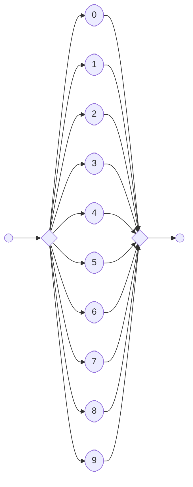

#### 13.2.2 Getal

```ebnf
<getal> ::= <geheelgetal> | <decimaalgetal> | <rationeelgetal>
```

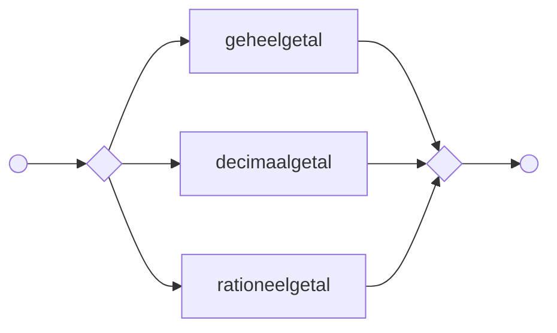

#### 13.2.3 Geheel getal

```ebnf
<geheelgetal> ::= ["-"]<digit>+
```

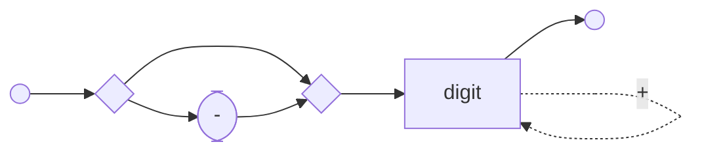

#### 13.2.4 Decimaal getal

```ebnf
<decimaalgetal> ::= ["-"]<digit>+ "," <digit>+
```

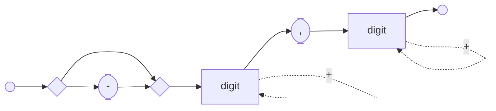

*pagina 7*

#### 13.2.5 Rationeel getal

```ebnf
<rationeelgetal> ::= <geheelgetal>["_"<geheelgetal>]"/"<geheelgetal>
```

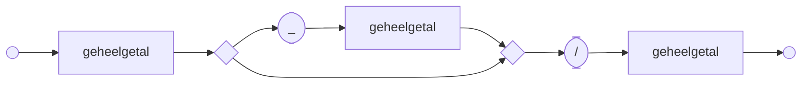

#### 13.2.6 Letter

```ebnf
<letter> ::= "a" | "b" | "c" | "d" | "e" | "f" | "g" | "h" | "i" | "j" | "k" | "l" | "m" | "o"
| "p" | "q" | "r" | "s" | "t" | "u" | "v" | "w" | "x" | "y" | "z" | "A" | "B" | "C" | "D" |
"E" | "F" | "G" | "H" | "I" | "J" | "K" | "L" | "M" | "N" | "O" | "P" | "Q" | "R" | "S" | "T"
| "U" | "V" | "W" | "X" | "Y" | "Z" | "á" | "à" | "â" | "ä" | "é" | "è" | "ê" | "ë" | "ó" |
"ò" | "ô" | "ö" | "ú" | "ù" | "û" | "ü" | "í" | "ì" | "î" | "ï"
```

*(syntaxdiagram te complex voor Mermaid — zie PDF pagina 8)*

*pagina 8*

#### 13.2.7 Leesteken

```ebnf
<leesteken> ::= "," | "." | "!" | "?" | ":" | ";" | "(" | ")" | "-"
```

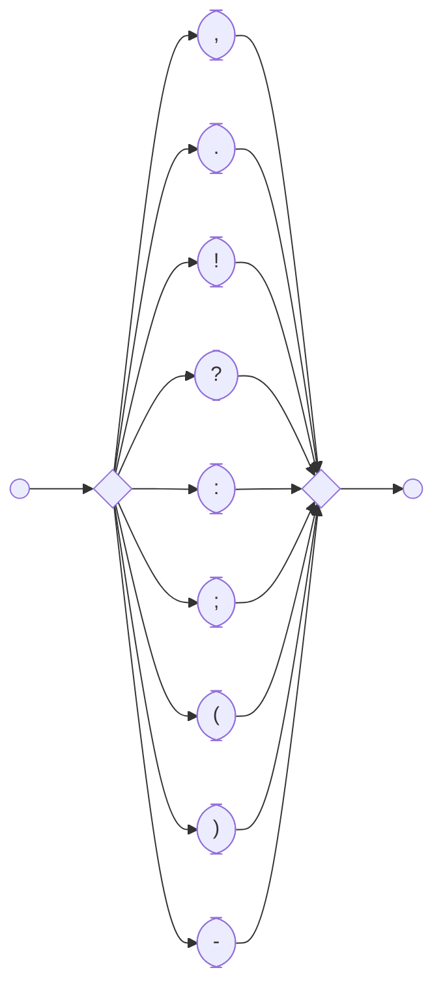

#### 13.2.8 Karakterreeks

```ebnf
<karakterreeks> ::= (<digit> | <letter> | " " | <leesteken> | <unicode>)+
```

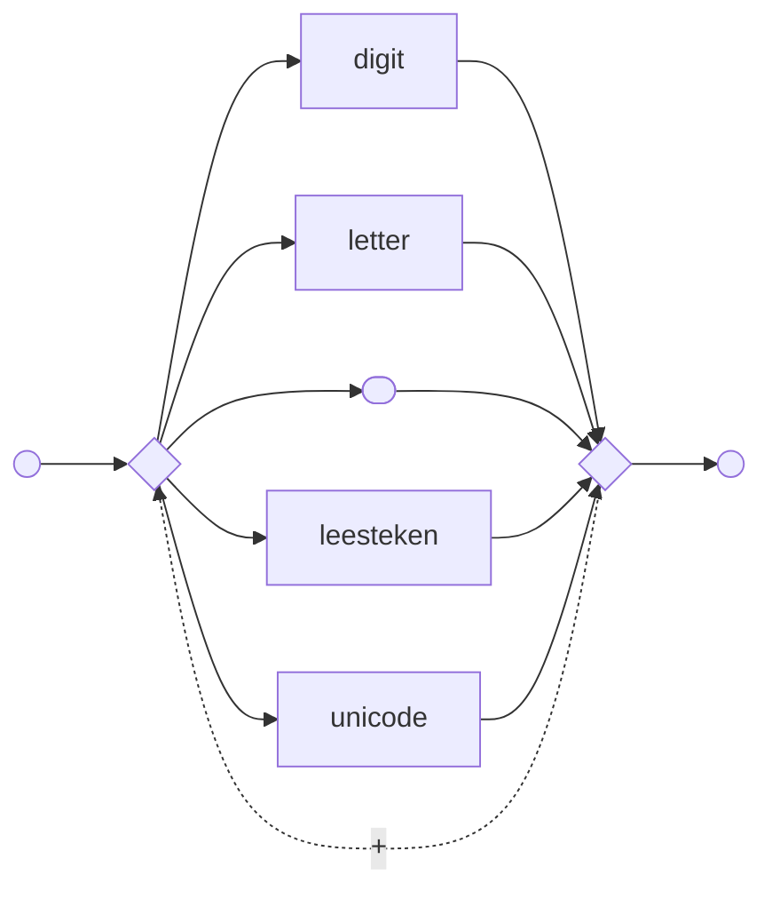

*Let op: zoals hierboven is te zien, kunnen in RegelSpraak Unicode karakters gebruikt worden. Unicode omvat (in 2023) bijna 150 duizend karakters. Deze karakters zijn vanwege de omvang niet volledig uitgewerkt in de syntax specificaties.*

#### 13.2.9 Lidwoord

```ebnf
<lidwoord> ::= <bepaaldlidwoord> | <onbepaaldlidwoord>
```

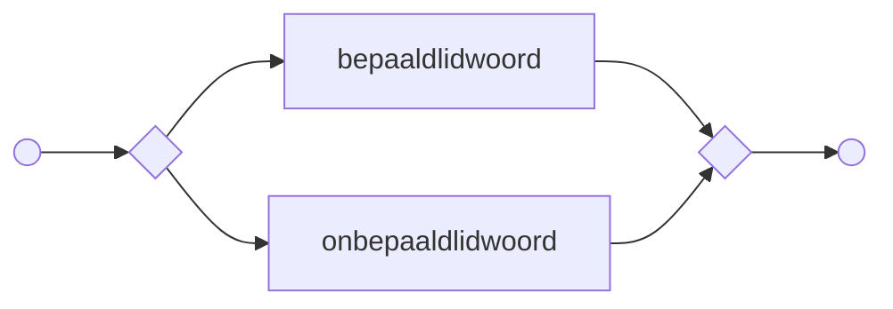

*pagina 9*

#### 13.2.10 Bepaallidwoord

```ebnf
<bepaaldlidwoord> ::= "de" | "het"
```

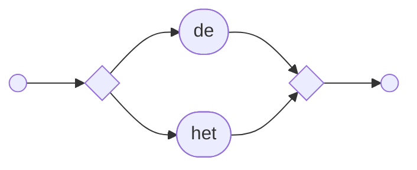

#### 13.2.11 Onbepaaldlidwoord

```ebnf
<onbepaaldlidwoord> ::= "een"
```

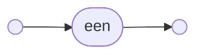

#### 13.2.13 Waarde

```ebnf
<waarde> ::= <tekstwaarde> | <booleanwaarde> | <getalwaarde> | <dedato>
```

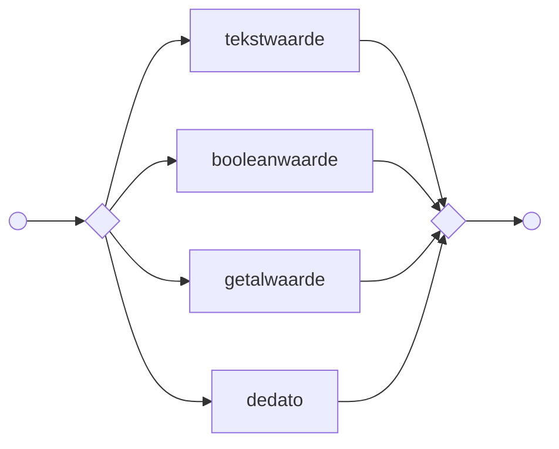

#### 13.2.13 Enumeratiewaarde

```ebnf
<enumeratiewaarde> ::= "’” <karakterreeks> “‘"
```

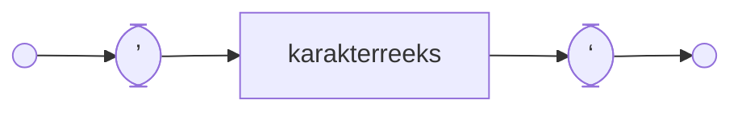

#### 13.2.14 Tekstwaarde

```ebnf
<tekstwaarde> ::= "\"" <karakterreeks> "\""
```

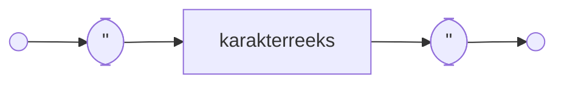

#### 13.2.15 Boolean waarde

```ebnf
<booleanwaarde> ::= ("waar" | "onwaar")
```

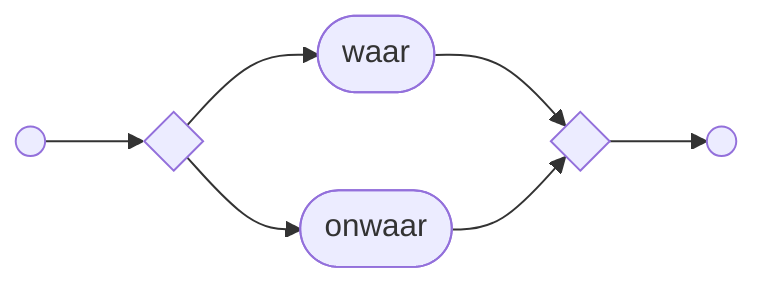

*pagina 10*

#### 13.2.16 Getalwaarde

```ebnf
<getalwaarde> ::= <getal> [(<eenheidsafkorting>+) | (<eenheidsafkorting>+ "/"
<eenheidsafkorting>+)]
```

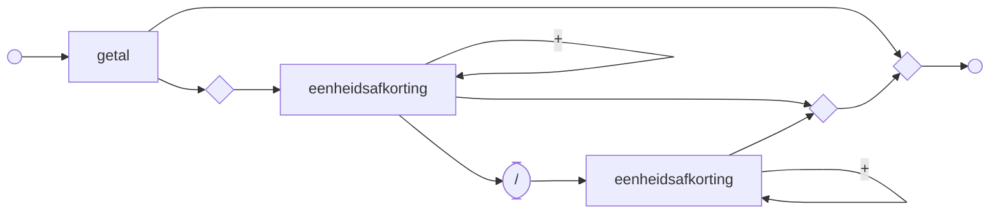

#### 13.2.17 Percentage

```ebnf
<percentage> ::= <getal> "%"
```

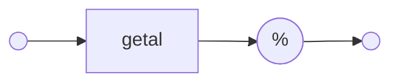

#### 13.2.18 De dato

```ebnf
<dedato> ::= "dd. "<datumwaarde> [<tijdwaarde>]
```

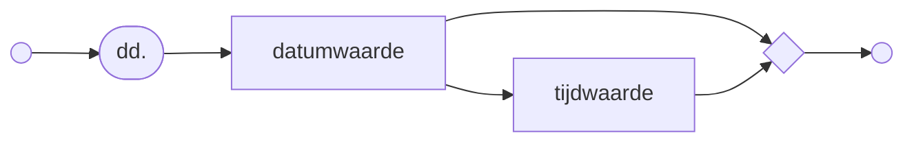

#### 13.2.19 Datumwaarde

```ebnf
<datumwaarde> ::= <dag>"-"<maand>"-"<jaar>
```

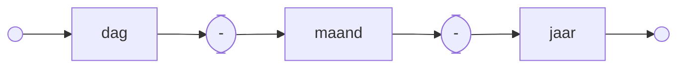

#### 13.2.20 Tijdwaarde

```ebnf
<tijdwaarde> ::= <uur>":"<minuut>":"<seconde>"."<milliseconde>
```

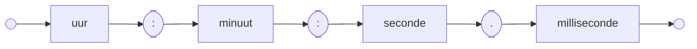

#### 13.2.21 Dag

```ebnf
<dag> ::= "1" | "2" | "3" | "4" | "5" | "6" | "7" | "8" | "9" | "10" | "11" | "12" | "13" |
"14" | "15" | "16" | "17" | "18" | "19" | "20" | "21" | "22" | "23" | "24" | "25" | "26" |
"27" | "28" | "29" | "30" | "31"
```

*pagina 11*

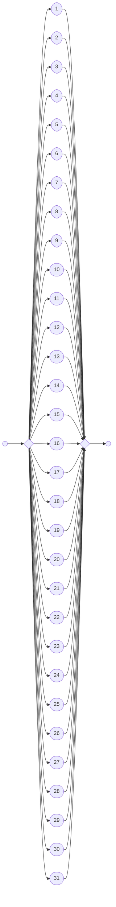

#### 13.2.22 Maand

```ebnf
<maand> ::= "1" | "2" | "3" | "4" | "5" | "6" | "7" | "8" | "9" | "10" | "11" | "12"
```

```mermaid
flowchart LR
    s0(( )) --> f{ }
    f --> n1(["1"])
    f --> n2(["2"])
    f --> n3(["3"])
    f --> n4(["4"])
    f --> n5(["5"])
    f --> n6(["6"])
    f --> n7(["7"])
    f --> n8(["8"])
    f --> n9(["9"])
    f --> n10(["10"])
    f --> n11(["11"])
    f --> n12(["12"])
    n1 --> j{ }
    n2 --> j
    n3 --> j
    n4 --> j
    n5 --> j
    n6 --> j
    n7 --> j
    n8 --> j
    n9 --> j
    n10 --> j
    n11 --> j
    n12 --> j
    j --> s1(( ))
```

*pagina 12*

#### 13.2.23 Jaar

```ebnf
<jaar> ::= ("0" | "1" | "2" | "3" | "4" | "5" | "6" | "7" | "8" | "9") ("0" | "1" | "2" | "3"
| "4" | "5" | "6" | "7" | "8" | "9") ("0" | "1" | "2" | "3" | "4" | "5" | "6" | "7" | "8" |
"9") ("0" | "1" | "2" | "3" | "4" | "5" | "6" | "7" | "8" | "9")
```

```mermaid
flowchart LR
    s0(( )) --> fa{ }
    fa --> a0(["0"])
    fa --> a1(["1"])
    fa --> a2(["2"])
    fa --> a3(["3"])
    fa --> a4(["4"])
    fa --> a5(["5"])
    fa --> a6(["6"])
    fa --> a7(["7"])
    fa --> a8(["8"])
    fa --> a9(["9"])
    a0 --> ja{ }
    a1 --> ja
    a2 --> ja
    a3 --> ja
    a4 --> ja
    a5 --> ja
    a6 --> ja
    a7 --> ja
    a8 --> ja
    a9 --> ja
    ja --> fb{ }
    fb --> b0(["0"])
    fb --> b1(["1"])
    fb --> b2(["2"])
    fb --> b3(["3"])
    fb --> b4(["4"])
    fb --> b5(["5"])
    fb --> b6(["6"])
    fb --> b7(["7"])
    fb --> b8(["8"])
    fb --> b9(["9"])
    b0 --> jb{ }
    b1 --> jb
    b2 --> jb
    b3 --> jb
    b4 --> jb
    b5 --> jb
    b6 --> jb
    b7 --> jb
    b8 --> jb
    b9 --> jb
    jb --> fc{ }
    fc --> c0(["0"])
    fc --> c1(["1"])
    fc --> c2(["2"])
    fc --> c3(["3"])
    fc --> c4(["4"])
    fc --> c5(["5"])
    fc --> c6(["6"])
    fc --> c7(["7"])
    fc --> c8(["8"])
    fc --> c9(["9"])
    c0 --> jc{ }
    c1 --> jc
    c2 --> jc
    c3 --> jc
    c4 --> jc
    c5 --> jc
    c6 --> jc
    c7 --> jc
    c8 --> jc
    c9 --> jc
    jc --> fd{ }
    fd --> d0(["0"])
    fd --> d1(["1"])
    fd --> d2(["2"])
    fd --> d3(["3"])
    fd --> d4(["4"])
    fd --> d5(["5"])
    fd --> d6(["6"])
    fd --> d7(["7"])
    fd --> d8(["8"])
    fd --> d9(["9"])
    d0 --> jd{ }
    d1 --> jd
    d2 --> jd
    d3 --> jd
    d4 --> jd
    d5 --> jd
    d6 --> jd
    d7 --> jd
    d8 --> jd
    d9 --> jd
    jd --> s1(( ))
```

*pagina 13*

#### 13.2.24 Uur

```ebnf
<uur> ::= "00" | "01" | "02" | "03" | "04" | "05" | "06" | "07" | "08" | "09" | "10" | "11" |
"12" | "13" | "14" | "15" | "16" | "17" | "18" | "19" | "20" | "21" | "22" | "23"
```

```mermaid
flowchart LR
    s0(( )) --> f{ }
    f --> n0(["00"])
    f --> n1(["01"])
    f --> n2(["02"])
    f --> n3(["03"])
    f --> n4(["04"])
    f --> n5(["05"])
    f --> n6(["06"])
    f --> n7(["07"])
    f --> n8(["08"])
    f --> n9(["09"])
    f --> n10(["10"])
    f --> n11(["11"])
    f --> n12(["12"])
    f --> n13(["13"])
    f --> n14(["14"])
    f --> n15(["15"])
    f --> n16(["16"])
    f --> n17(["17"])
    f --> n18(["18"])
    f --> n19(["19"])
    f --> n20(["20"])
    f --> n21(["21"])
    f --> n22(["22"])
    f --> n23(["23"])
    n0 --> j{ }
    n1 --> j
    n2 --> j
    n3 --> j
    n4 --> j
    n5 --> j
    n6 --> j
    n7 --> j
    n8 --> j
    n9 --> j
    n10 --> j
    n11 --> j
    n12 --> j
    n13 --> j
    n14 --> j
    n15 --> j
    n16 --> j
    n17 --> j
    n18 --> j
    n19 --> j
    n20 --> j
    n21 --> j
    n22 --> j
    n23 --> j
    j --> s1(( ))
```

*pagina 14*

#### 13.2.25 Minuut

```ebnf
<minuut> ::= ("0" | "1" | "2" | "3" | "4" | "5") ("0" | "1" | "2" | "3" | "4" | "5" | "6" |
"7" | "8" | "9")
```

```mermaid
flowchart LR
    s0(( )) --> fa{ }
    fa --> a0(["0"])
    fa --> a1(["1"])
    fa --> a2(["2"])
    fa --> a3(["3"])
    fa --> a4(["4"])
    fa --> a5(["5"])
    a0 --> ja{ }
    a1 --> ja
    a2 --> ja
    a3 --> ja
    a4 --> ja
    a5 --> ja
    ja --> fb{ }
    fb --> b0(["0"])
    fb --> b1(["1"])
    fb --> b2(["2"])
    fb --> b3(["3"])
    fb --> b4(["4"])
    fb --> b5(["5"])
    fb --> b6(["6"])
    fb --> b7(["7"])
    fb --> b8(["8"])
    fb --> b9(["9"])
    b0 --> jb{ }
    b1 --> jb
    b2 --> jb
    b3 --> jb
    b4 --> jb
    b5 --> jb
    b6 --> jb
    b7 --> jb
    b8 --> jb
    b9 --> jb
    jb --> s1(( ))
```

*pagina 15*


#### 13.2.26 Seconde

```ebnf
<seconde> ::= ("0" | "1" | "2" | "3" | "4" | "5") ("0" | "1" | "2" | "3" | "4" | "5" | "6" |
"7" | "8" | "9")
```

```mermaid
flowchart LR
    s0(( )) --> fa{ }
    fa --> a0(["0"])
    fa --> a1(["1"])
    fa --> a2(["2"])
    fa --> a3(["3"])
    fa --> a4(["4"])
    fa --> a5(["5"])
    a0 --> ja{ }
    a1 --> ja
    a2 --> ja
    a3 --> ja
    a4 --> ja
    a5 --> ja
    ja --> fb{ }
    fb --> b0(["0"])
    fb --> b1(["1"])
    fb --> b2(["2"])
    fb --> b3(["3"])
    fb --> b4(["4"])
    fb --> b5(["5"])
    fb --> b6(["6"])
    fb --> b7(["7"])
    fb --> b8(["8"])
    fb --> b9(["9"])
    b0 --> jb{ }
    b1 --> jb
    b2 --> jb
    b3 --> jb
    b4 --> jb
    b5 --> jb
    b6 --> jb
    b7 --> jb
    b8 --> jb
    b9 --> jb
    jb --> s1(( ))
```

*pagina 16*

#### 13.2.27 Milliseconde

```ebnf
<milliseconde> ::= ("0" | "1" | "2" | "3" | "4" | "5" | "6" | "7" | "8" | "9") ("0" | "1" |
"2" | "3" | "4" | "5" | "6" | "7" | "8" | "9") ("0" | "1" | "2" | "3" | "4" | "5" | "6" | "7"
| "8" | "9")
```

```mermaid
flowchart LR
    s0(( )) --> fa{ }
    fa --> a0(["0"])
    fa --> a1(["1"])
    fa --> a2(["2"])
    fa --> a3(["3"])
    fa --> a4(["4"])
    fa --> a5(["5"])
    fa --> a6(["6"])
    fa --> a7(["7"])
    fa --> a8(["8"])
    fa --> a9(["9"])
    a0 --> ja{ }
    a1 --> ja
    a2 --> ja
    a3 --> ja
    a4 --> ja
    a5 --> ja
    a6 --> ja
    a7 --> ja
    a8 --> ja
    a9 --> ja
    ja --> fb{ }
    fb --> b0(["0"])
    fb --> b1(["1"])
    fb --> b2(["2"])
    fb --> b3(["3"])
    fb --> b4(["4"])
    fb --> b5(["5"])
    fb --> b6(["6"])
    fb --> b7(["7"])
    fb --> b8(["8"])
    fb --> b9(["9"])
    b0 --> jb{ }
    b1 --> jb
    b2 --> jb
    b3 --> jb
    b4 --> jb
    b5 --> jb
    b6 --> jb
    b7 --> jb
    b8 --> jb
    b9 --> jb
    jb --> fc{ }
    fc --> c0(["0"])
    fc --> c1(["1"])
    fc --> c2(["2"])
    fc --> c3(["3"])
    fc --> c4(["4"])
    fc --> c5(["5"])
    fc --> c6(["6"])
    fc --> c7(["7"])
    fc --> c8(["8"])
    fc --> c9(["9"])
    c0 --> jc{ }
    c1 --> jc
    c2 --> jc
    c3 --> jc
    c4 --> jc
    c5 --> jc
    c6 --> jc
    c7 --> jc
    c8 --> jc
    c9 --> jc
    jc --> s1(( ))
```

*pagina 17*

#### 13.2.28 Naamwoord

```ebnf
<naamwoord> ::= [<bepaaldlidwoord>] <naam> ["(mv:" <meervoudsvorm> ")"]
```

```mermaid
flowchart LR
    s0(( )) --> n1["bepaaldlidwoord"]
    s0 --> n2["naam"]
    n1 --> n2
    n2 --> n3(["(mv:"])
    n2 --> s1(( ))
    n3 --> n4["meervoudsvorm"]
    n4 --> n5([")"])
    n5 --> s1
```

#### 13.2.29 Naam

```ebnf
<naam> ::=     <karakterreeks>
```

```mermaid
flowchart LR
    s0(( )) --> n1["karakterreeks"]
    n1 --> s1(( ))
```

#### 13.2.30 Meervoudsvorm

```ebnf
<meervoudsvorm> ::= <karakterreeks>
```

```mermaid
flowchart LR
    s0(( )) --> n1["karakterreeks"]
    n1 --> s1(( ))
```

*pagina 18*

### 13.3 Objecten en parameters

#### 13.3.1 Objecttypen

##### 13.3.1.1 Objecttypedefinitie

```ebnf
<objecttypedefinitie> ::= "Objecttype" <naamwoord> ["(bezield)"] \n
((<koptekst> | <kenmerk> | <attribuut>) \n)+
```

```mermaid
flowchart LR
    s0(( )) --> n1(["Objecttype"])
    n1 --> n2["naamwoord"]
    n2 --> n3(["(bezield)"])
    n2 --> n4(["\n"])
    n3 --> n4
    n4 --> f{ }
    f --> k1["koptekst"]
    f --> k2["kenmerk"]
    f --> k3["attribuut"]
    k1 --> j{ }
    k2 --> j
    k3 --> j
    j --> n5(["\n"])
    n5 --> s1(( ))
    n5 -->|+| f
```

##### 13.3.1.2 Objecttype met lidwoord

```ebnf
<objecttypemetlidwoord> ::= <bepaaldlidwoord> <objecttypenaam>
```

```mermaid
flowchart LR
    s0(( )) --> n1["bepaaldlidwoord"]
    n1 --> n2["objecttypenaam"]
    n2 --> s1(( ))
```

##### 13.3.1.3 Objecttypenaam

```ebnf
<objecttypenaam> ::= <karakterreeks>
```

```mermaid
flowchart LR
    s0(( )) --> n1["karakterreeks"]
    n1 --> s1(( ))
```

##### 13.3.1.4 Koptekst

```ebnf
<koptekst> ::= "---" <karakterreeks>
```

```mermaid
flowchart LR
    s0(( )) --> n1(["---"])
    n1 --> n2["karakterreeks"]
    n2 --> s1(( ))
```

#### 13.3.2 Attributen en kenmerken

##### 13.3.2.1 Kenmerk

```ebnf
<kenmerk> ::= ((<naamwoord> "kenmerk") | <bezittelijkkenmerk> | <bijvoeglijkkenmerk>)";"
```

```mermaid
flowchart LR
    s0(( )) --> f{ }
    f --> n1["naamwoord"]
    n1 --> n2(["kenmerk"])
    f --> n3["bezittelijkkenmerk"]
    f --> n4["bijvoeglijkkenmerk"]
    n2 --> j{ }
    n3 --> j
    n4 --> j
    j --> n5([";"])
    n5 --> s1(( ))
```

##### 13.3.2.2 Bezittelijk kenmerk

```ebnf
<bezittelijkkenmerk> ::= <naamwoord> "kenmerk (bezittelijk)"
```

```mermaid
flowchart LR
    s0(( )) --> n1["naamwoord"]
    n1 --> n2(["kenmerk (bezittelijk)"])
    n2 --> s1(( ))
```

*pagina 19*

##### 13.3.2.3 Bijvoeglijk kenmerk

```ebnf
<bijvoeglijkkenmerk> ::= "is" <naam> ["(mv: " <meervoudsvorm> ")"] "kenmerk (bijvoeglijk)"
```

```mermaid
flowchart LR
    s0(( )) --> n1(["is"])
    n1 --> n2["naam"]
    n2 --> n3(["(mv: "])
    n2 --> n6(["kenmerk (bijvoeglijk)"])
    n3 --> n4["meervoudsvorm"]
    n4 --> n5([")"])
    n5 --> n6
    n6 --> s1(( ))
```

##### 13.3.2.4 Kenmerknaam

```ebnf
<kenmerknaam> ::= <karakterreeks>
```

```mermaid
flowchart LR
    s0(( )) --> n1["karakterreeks"]
    n1 --> s1(( ))
```

##### 13.3.2.5 Attribuut

```ebnf
<attribuut> ::= <naamwoord> \t (<datatype> | <domeinnaam>) ["gedimensioneerd met"
<dimensienaam>] ";"
```

```mermaid
flowchart LR
    s0(( )) --> n1["naamwoord"]
    n1 --> n2(["\t"])
    n2 --> f{ }
    f --> n3["datatype"]
    f --> n4["domeinnaam"]
    n3 --> j{ }
    n4 --> j
    j --> n5(["gedimensioneerd met"])
    j --> n7([";"])
    n5 --> n6["dimensienaam"]
    n6 --> n7
    n7 --> s1(( ))
```

##### 13.3.2.6 Attribuut met lidwoord

```ebnf
<attribuutmetlidwoord> ::= [<bepaaldlidwoord>] <attribuutnaam>
```

```mermaid
flowchart LR
    s0(( )) --> n1["bepaaldlidwoord"]
    s0 --> n2["attribuutnaam"]
    n1 --> n2
    n2 --> s1(( ))
```

##### 13.3.2.7 Attribuutnaam

```ebnf
<attribuutnaam> ::= <karakterreeks>
```

```mermaid
flowchart LR
    s0(( )) --> n1["karakterreeks"]
    n1 --> s1(( ))
```

#### 13.3.3 Datatypen

##### 13.3.3.1 Datatype

```ebnf
<datatype> ::= <numeriekdatatype> | <percentagedatatype> | <tekstdatatype> | <booleandatatype>
| <datumtijddatatype>
```

*pagina 20*

```mermaid
flowchart LR
    s0(( )) --> n1["numeriekdatatype"]
    s0 --> n2["percentagedatatype"]
    s0 --> n3["tekstdatatype"]
    s0 --> n4["booleandatatype"]
    s0 --> n5["datumtijddatatype"]
    n1 --> s1(( ))
    n2 --> s1
    n3 --> s1
    n4 --> s1
    n5 --> s1
```

##### 13.3.3.2 Numeriek datatype

```ebnf
<numeriekdatatype> ::= "Numeriek (" <getalspecificatie>   ")" ["met eenheid" [(<eenheidmacht>+
| "1") "/"](<eenheidmacht>+)]
```

```mermaid
flowchart LR
    s0(( )) --> n1(["Numeriek ("])
    n1 --> n2["getalspecificatie"]
    n2 --> n3([")"])
    n3 --> n4(["met eenheid"])
    n3 --> s1(( ))
    n4 --> n5["eenheidmacht"]
    n4 --> n6(["1"])
    n4 --> n8
    n5 --> n5
    n5 --> n7([" / "])
    n6 --> n7
    n7 --> n8["eenheidmacht"]
    n8 --> n8
    n8 --> s1
```

##### 13.3.3.3 Percentage datatype

```ebnf
<percentagedatatype> ::= "Percentage (" <getalspecificatie>   ")" ["met eenheid %" ["/"
<eenheidsafkorting>]]
```

```mermaid
flowchart LR
    s0(( )) --> n1(["Percentage ("])
    n1 --> n2["getalspecificatie"]
    n2 --> n3([")"])
    n3 --> n4(["met eenheid %"])
    n3 --> s1(( ))
    n4 --> n5([" / "])
    n4 --> s1
    n5 --> n6["eenheidsafkorting"]
    n6 --> s1
```

##### 13.3.3.4 Tekst datatype

```ebnf
<tekstdatatype> ::= "Tekst"
```

```mermaid
flowchart LR
    s0(( )) --> n1(["Tekst"])
    n1 --> s1(( ))
```

##### 13.3.3.5 Boolean datatype

```ebnf
<booleandatatype> ::= "Boolean"
```

```mermaid
flowchart LR
    s0(( )) --> n1(["Boolean"])
    n1 --> s1(( ))
```

##### 13.3.3.6 Datum-tijd datatype

```ebnf
<datumtijddatatype> ::= "Datum in dagen" | "Datum en tijd in millisecondes"
```

*pagina 21*

```mermaid
flowchart LR
    s0(( )) --> n1(["Datum in dagen"])
    s0 --> n2(["Datum en tijd in millisecondes"])
    n1 --> s1(( ))
    n2 --> s1
```

##### 13.3.3.7 Getalspecificatie

```ebnf
<getalspecificatie> ::= ["negatief" | "niet-negatief" | "positief"] ("geheel getal" | "getal
met " <aantaldecimalen> " decimalen" | "getal")
```

```mermaid
flowchart LR
    s0(( )) --> n1(["negatief"])
    s0 --> n2(["niet-negatief"])
    s0 --> n3(["positief"])
    s0 --> fork(( ))
    n1 --> fork
    n2 --> fork
    n3 --> fork
    fork --> n4(["geheel getal"])
    fork --> n5(["getal met "])
    fork --> n7(["getal"])
    n5 --> n6["aantaldecimalen"]
    n6 --> n8([" decimalen"])
    n4 --> s1(( ))
    n8 --> s1
    n7 --> s1
```

##### 13.3.3.8 Aantal decimalen

```ebnf
<aantaldecimalen> ::= <positiefgeheelgetal>
```

```mermaid
flowchart LR
    s0(( )) --> n1["positiefgeheelgetal"]
    n1 --> s1(( ))
```

#### 13.3.4 Domeinen

##### 13.3.4.1 Domeindefinitie

```ebnf
<domeindefinitie> ::= "Domein" <domeinnaam> "is van het type" (<datatype> |
<enumeratiespecificatie>)
```

```mermaid
flowchart LR
    s0(( )) --> n1(["Domein"])
    n1 --> n2["domeinnaam"]
    n2 --> n3(["is van het type"])
    n3 --> n4["datatype"]
    n3 --> n5["enumeratiespecificatie"]
    n4 --> s1(( ))
    n5 --> s1
```

##### 13.3.4.2 Enumeratiespecificatie

```ebnf
<enumeratiespecificatie> ::= "Enumeratie" \n (\t <enumeratiewaarde> \n)+
```

```mermaid
flowchart LR
    s0(( )) --> n1(["Enumeratie"])
    n1 --> n2(["\n"])
    n2 --> n3(["\t"])
    n3 --> n4["enumeratiewaarde"]
    n4 --> n5(["\n"])
    n5 --> n3
    n5 --> s1(( ))
```

##### 13.3.4.3 Domeinnaam

```ebnf
<domeinnaam> ::= <karakterreeks>
```

*pagina 22*

```mermaid
flowchart LR
    s0(( )) --> n1["karakterreeks"]
    n1 --> s1(( ))
```

##### 13.3.4.4 Enumeratiewaarde

```ebnf
<enumeratiewaarde> ::= <karakterreeks>
```

```mermaid
flowchart LR
    s0(( )) --> n1["karakterreeks"]
    n1 --> s1(( ))
```

#### 13.3.5 Eenheden

##### 13.3.5.1 Eenheidsysteem

```ebnf
<eenheidsysteem> ::= "Eenheidsysteem" <eenheidsysteemnaam>
(\n <naamwoord> <eenheidsafkorting> [<omrekenspecificatie>])+
```

```mermaid
flowchart LR
    s0(( )) --> n1(["Eenheidsysteem"])
    n1 --> n2["eenheidsysteemnaam"]
    n2 --> n3(["\n"])
    n3 --> n4["naamwoord"]
    n4 --> n5["eenheidsafkorting"]
    n5 --> n6["omrekenspecificatie"]
    n5 --> n7(( ))
    n6 --> n7
    n7 --> n3
    n7 --> s1(( ))
```

##### 13.3.5.2 Omrekenspecificatie

```ebnf
<omrekenspecificatie> ::= "=" ["1/"]<geheelgetal> <eenheidsafkorting>
```

```mermaid
flowchart LR
    s0(( )) --> n1(["="])
    n1 --> n2(["1/"])
    n1 --> n3["geheelgetal"]
    n2 --> n3
    n3 --> n4["eenheidsafkorting"]
    n4 --> s1(( ))
```

##### 13.3.5.3 Eenheidsysteemnaam

```ebnf
<eenheidsysteemnaam> ::= <karakterreeks>
```

```mermaid
flowchart LR
    s0(( )) --> n1["karakterreeks"]
    n1 --> s1(( ))
```

##### 13.3.5.4 Eenheidsafkorting

```ebnf
<eenheidsafkorting> ::= <karakterreeks>
```

```mermaid
flowchart LR
    s0(( )) --> n1["karakterreeks"]
    n1 --> s1(( ))
```

##### 13.3.5.5 Eenheidmacht

```ebnf
<eenheidmacht> ::= <eenheidsafkorting>[^(<exponent>)]
```

```mermaid
flowchart LR
    s0(( )) --> n1["eenheidsafkorting"]
    n1 --> n2(["^"])
    n1 --> s1(( ))
    n2 --> n3["exponent"]
    n3 --> s1
```

*pagina 23*

##### 13.3.5.6 Exponent

```ebnf
<exponent> ::= <geheelgetal>
```

```mermaid
flowchart LR
    s0(( )) --> n1["geheelgetal"]
    n1 --> s1(( ))
```

#### 13.3.6 Tijdlijnen

##### 13.3.6.1 Tijdlijn

```ebnf
<tijdlijn> ::= "voor" ("elke dag" | "elke maand" | "elk jaar")
```

```mermaid
flowchart LR
    s0(( )) --> n1(["voor"])
    n1 --> n2(["elke dag"])
    n1 --> n3(["elke maand"])
    n1 --> n4(["elk jaar"])
    n2 --> s1(( ))
    n3 --> s1
    n4 --> s1
```

#### 13.3.7 Dimensies

##### 13.3.7.1 Dimensie

```ebnf
<dimensie> ::= "Dimensie" <bepaaldlidwoord> <dimensienaam> ", bestaande uit de "
<dimensienaammeervoud> <voorzetselspecificatie> \n (<labelwaardespecificatie> \n)+
```

```mermaid
flowchart LR
    s0(( )) --> n1(["Dimensie"])
    n1 --> n2["bepaaldlidwoord"]
    n2 --> n3["dimensienaam"]
    n3 --> n4([", bestaande uit de "])
    n4 --> n5["dimensienaammeervoud"]
    n5 --> n6["voorzetselspecificatie"]
    n6 --> n7(["\n"])
    n7 --> n8["labelwaardespecificatie"]
    n8 --> n9(["\n"])
    n9 --> n8
    n9 --> s1(( ))
```

##### 13.3.7.2 Voorzetselspecificatie

```ebnf
<voorzetselspecificatie> ::= ("(na het attribuut met voorzetsel" ( "van" | "in" | "voor" |
"over" | "op" | "bij" | "uit" ) "):" | "(voor het attribuut zonder voorzetsel):")
```

*pagina 24*

```mermaid
flowchart LR
    s0(( )) --> n1(["(na het attribuut met voorzetsel"])
    s0 --> n10(["(voor het attribuut zonder voorzetsel):"])
    n1 --> n2(["van"])
    n1 --> n3(["in"])
    n1 --> n4(["voor"])
    n1 --> n5(["over"])
    n1 --> n6(["op"])
    n1 --> n7(["bij"])
    n1 --> n8(["uit"])
    n2 --> n9(["):"])
    n3 --> n9
    n4 --> n9
    n5 --> n9
    n6 --> n9
    n7 --> n9
    n8 --> n9
    n9 --> s1(( ))
    n10 --> s1
```

##### 13.3.7.3 Dimensienaam

```ebnf
<dimensienaam> ::= <karakterreeks>
```

```mermaid
flowchart LR
    s0(( )) --> n1["karakterreeks"]
    n1 --> s1(( ))
```

##### 13.3.7.4 Dimensienaam meervoud

```ebnf
<dimensienaammeervoud> ::= <karakterreeks>
```

```mermaid
flowchart LR
    s0(( )) --> n1["karakterreeks"]
    n1 --> s1(( ))
```

##### 13.3.7.5 Labelwaardespecificatie

```ebnf
<labelwaardespecificatie> ::= <digit>+". " <dimensiewaarde>
```

```mermaid
flowchart LR
    s0(( )) --> n1["digit"]
    n1 --> n1
    n1 --> n2(["."])
    n2 --> n3["dimensiewaarde"]
    n3 --> s1(( ))
```

##### 13.3.7.6 Dimensiewaarde

```ebnf
<dimensiewaarde> ::= <karakterreeks>
```

```mermaid
flowchart LR
    s0(( )) --> n1["karakterreeks"]
    n1 --> s1(( ))
```

*pagina 25*

### 13.3.8 Parameters

#### 13.3.7.1 Parameterdefinitie

```ebnf
<parameterdefinitie> ::= "Parameter" <parametermetlidwoord> ":" (<datatype> | <domeinnaam>)
```

```mermaid
flowchart LR
    s0(( )) --> n1(["Parameter"])
    n1 --> n2["parametermetlidwoord"]
    n2 --> n3([":"])
    n3 --> n4["datatype"]
    n3 --> n5["domeinnaam"]
    n4 --> s1(( ))
    n5 --> s1(( ))
```

#### 13.3.8.2 Parameter met lidwoord

```ebnf
<parametermetlidwoord> ::= <bepaaldlidwoord> <parameternaam>
```

```mermaid
flowchart LR
    s0(( )) --> n1["bepaaldlidwoord"]
    n1 --> n2["parameternaam"]
    n2 --> s1(( ))
```

#### 13.3.8.3 Parameternaam

```ebnf
<parameternaam> ::= <karakterreeks>
```

```mermaid
flowchart LR
    s0(( )) --> n1["karakterreeks"]
    n1 --> s1(( ))
```

### 13.3.9 Feittypen

#### 13.3.9.1 Feittype definitie

```ebnf
<feittypedefinitie> ::= "Feittype" <feittypenaam> \n [<bepaaldlidwoord>] <rolnaam> ["(mv: "
<meervoudrolnaam> ")"] \t <objecttypenaam> \n [<bepaaldlidwoord>] <rolnaam> ["(mv: "
<meervoudrolnaam> ")"] \t <objecttypenaam> \n ("één" <rolnaam> | "meerdere"
<meervoudrolnaam>) <relatiebeschrijving> ("één" <rolnaam> | "meerdere" <meervoudrolnaam>)
```

*(syntaxdiagram te complex voor Mermaid — zie PDF pagina 26)*

#### 13.3.9.2 Wederkerig feittype definitie

```ebnf
<wederkerigfeittypedefinitie> ::= "Wederkerig feittype" <feittypenaam> \n [<bepaaldlidwoord>]
<rolnaam> ["(mv: " <meervoudrolnaam> ")"] \t <objecttypenaam> \n (("één" <rolnaam>
<relatiebeschrijving> "één" <rolnaam>) | ("meerdere" <rolnaam> <relatiebeschrijving>
"meerdere" <rolnaam>))
```

*(syntaxdiagram te complex voor Mermaid — zie PDF pagina 26)*

*pagina 26*

#### 13.3.9.3 Feittypenaam

```ebnf
<feittypenaam> ::= <karakterreeks>
```

```mermaid
flowchart LR
    s0(( )) --> n1["karakterreeks"]
    n1 --> s1(( ))
```

#### 13.3.9.4 Rolnaam

```ebnf
<rolnaam> ::= <karakterreeks>
```

```mermaid
flowchart LR
    s0(( )) --> n1["karakterreeks"]
    n1 --> s1(( ))
```

#### 13.3.9.5 Meervoudrolnaam

```ebnf
<meervoudrolnaam> ::= <karakterreeks>
```

```mermaid
flowchart LR
    s0(( )) --> n1["karakterreeks"]
    n1 --> s1(( ))
```

#### 13.3.9.6 Relatiebeschrijving

```ebnf
<relatiebeschrijving> ::= <karakterreeks>
```

```mermaid
flowchart LR
    s0(( )) --> n1["karakterreeks"]
    n1 --> s1(( ))
```

### 13.3.10 Dagsoort

#### 13.3.10.1 Dagsoort

```ebnf
<dagsoort> ::= "Dagsoort" <naamwoord>
```

```mermaid
flowchart LR
    s0(( )) --> n1(["Dagsoort"])
    n1 --> n2["naamwoord"]
    n2 --> s1(( ))
```

#### 13.3.10.2 Dagsoortnaam

```ebnf
<dagsoortnaam> ::= <karakterreeks>
```

```mermaid
flowchart LR
    s0(( )) --> n1["karakterreeks"]
    n1 --> s1(( ))
```

*pagina 27*

## 13.4 RegelSpraak

### 13.4.1 Onderwerpketen

#### 13.4.1.1 Onderwerpketen

```ebnf
<onderwerpketen> ::= ((<lidwoord> | "zijn") (<objecttypenaam> | <rolnaam> | <kenmerknaam>)) |
((<selector> "van" <onderwerpketen>) | <subselectie>)
```

*(syntaxdiagram te complex voor Mermaid — zie PDF pagina 28)*

### 13.4.2 RegelSpraak-regel

#### 13.4.2.1 Regel

```ebnf
<regel> ::= "Regel" <regelnaam> (\n <regelversie>)+
```

```mermaid
flowchart LR
    s0(( )) --> n1(["Regel"])
    n1 --> n2["regelnaam"]
    n2 --> n3(["\n"])
    n3 --> n4["regelversie"]
    n4 --> n3
    n4 --> s1(( ))
```

#### 13.4.2.2 Regelnaam

```ebnf
<regelnaam> ::= <karakterreeks>
```

```mermaid
flowchart LR
    s0(( )) --> n1["karakterreeks"]
    n1 --> s1(( ))
```

#### 13.4.2.3 Regelversie

```ebnf
<regelversie> ::= <versie> \n <regelspraakregel>
```

```mermaid
flowchart LR
    s0(( )) --> n1["versie"]
    n1 --> n2(["\n"])
    n2 --> n3["regelspraakregel"]
    n3 --> s1(( ))
```

#### 13.4.2.4 Versie

```ebnf
<versie> ::= "geldig" <versiegeldigheid>
```

```mermaid
flowchart LR
    s0(( )) --> n1(["geldig"])
    n1 --> n2["versiegeldigheid"]
    n2 --> s1(( ))
```

#### 13.4.2.5 Versiegeldigheid

```ebnf
<versiegeldigheid> ::= "altijd" | ("vanaf " (<datumwaarde> | <jaar>) ["t/m " (<datumwaarde> |
<jaar>)]) | ("t/m " (<datumwaarde> | <jaar>))
```

*(syntaxdiagram te complex voor Mermaid — zie PDF pagina 28)*

*pagina 28*

#### 13.4.2.6 RegelSpraakregel

```ebnf
<regelSpraakregel> ::= <resultaatdeel> \n [<voorwaardendeel>] "." [<variabelendeel>]
```

```mermaid
flowchart LR
    s0(( )) --> n1["resultaatdeel"]
    n1 --> n2(["\n"])
    n2 --> n3["voorwaardendeel"]
    n2 --> n4([&quot;.&quot;])
    n3 --> n4
    n4 --> n5["variabelendeel"]
    n4 --> s1(( ))
    n5 --> s1(( ))
```

#### 13.4.2.7 Selector

```ebnf
<selector> ::= [<lidwoord>] <rolnaam>
```

```mermaid
flowchart LR
    s0(( )) --> n1["lidwoord"]
    s0 --> n2["rolnaam"]
    n1 --> n2
    n2 --> s1(( ))
```

#### 13.4.2.8 Subselectie

```ebnf
<subselectie> ::= <onderwerpketen> ("die" | "dat") <predicaat>
```

```mermaid
flowchart LR
    s0(( )) --> n1["onderwerpketen"]
    n1 --> n2(["die"])
    n1 --> n3(["dat"])
    n2 --> n4["predicaat"]
    n3 --> n4
    n4 --> s1(( ))
```

#### 13.4.2.9 Attribuut van onderwerp

```ebnf
<attribuutvanonderwerp> ::= [<kwantificatie>] <attribuutmetlidwoord> "van" <onderwerpketen>
```

```mermaid
flowchart LR
    s0(( )) --> n1["kwantificatie"]
    s0 --> n2["attribuutmetlidwoord"]
    n1 --> n2
    n2 --> n3(["van"])
    n3 --> n4["onderwerpketen"]
    n4 --> s1(( ))
```

#### 13.4.2.10 Variabelendeel

```ebnf
<variabelendeel> ::= "Daarbij geldt:" (\n \t <variabeleonderdeel>)* "."
```

```mermaid
flowchart LR
    s0(( )) --> n1(["Daarbij geldt:"])
    n1 --> n2(["\n"])
    n2 --> n3(["\t"])
    n3 --> n4["variabeleonderdeel"]
    n4 --> n2
    n1 --> n5([&quot;.&quot;])
    n4 --> n5
    n5 --> s1(( ))
```

*pagina 29*

#### 13.4.2.11 Variabele onderdeel

```ebnf
<variabeleonderdeel> ::= [ <bepaaldlidwoord> ] <variabelenaam> "is" <expressie>
```

```mermaid
flowchart LR
    s0(( )) --> n1["bepaaldlidwoord"]
    s0 --> n2["variabelenaam"]
    n1 --> n2
    n2 --> n3(["is"])
    n3 --> n4["expressie"]
    n4 --> s1(( ))
```

#### 13.4.2.12 Variabelenaam

```ebnf
<variabelenaam> ::= <karakterreeks>
```

```mermaid
flowchart LR
    s0(( )) --> n1["karakterreeks"]
    n1 --> s1(( ))
```

### 13.4.3 Resultaatdeel

#### 13.4.3.1 Resultaatdeel

```ebnf
<resultaatdeel> ::= <gelijkstelling> | <kenmerktoekenning> | <objectcreatie> | <feitcreatie> |
<consistentieregel> | <initialisatie> | <verdeling> | <dagsoortdefinitie>
```

```mermaid
flowchart LR
    s0(( )) --> n1["gelijkstelling"]
    s0 --> n2["kenmerktoekenning"]
    s0 --> n3["objectcreatie"]
    s0 --> n4["feitcreatie"]
    s0 --> n5["consistentieregel"]
    s0 --> n6["initialisatie"]
    s0 --> n7["verdeling"]
    s0 --> n8["dagsoortdefinitie"]
    n1 --> s1(( ))
    n2 --> s1(( ))
    n3 --> s1(( ))
    n4 --> s1(( ))
    n5 --> s1(( ))
    n6 --> s1(( ))
    n7 --> s1(( ))
    n8 --> s1(( ))
```

*pagina 30*
### 13.4.4 Gelijkstelling

#### 13.4.4.1 Gelijkstelling

```ebnf
<gelijkstelling> ::= (<gelijkstellingtoekenning> | <gelijkstellingberekening>)
```

```mermaid
flowchart LR
    s0(( )) --> n1["gelijkstellingtoekenning"]
    s0 --> n2["gelijkstellingberekening"]
    n1 --> s1(( ))
    n2 --> s1(( ))
```

#### 13.4.4.2 Gelijkstellingtoekenning

```ebnf
<gelijkstellingtoekenning> ::= <attribuutvanonderwerp> "moet gesteld worden op" <expressie>
```

```mermaid
flowchart LR
    s0(( )) --> n1["attribuutvanonderwerp"]
    n1 --> n2(["moet gesteld worden op"])
    n2 --> n3["expressie"]
    n3 --> s1(( ))
```

#### 13.4.4.3 Gelijkstellingberekening

```ebnf
<gelijkstellingberekening> ::= <attribuutvanonderwerp> "moet berekend worden als"
(<getalexpressie> | <datumexpressie>)
```

```mermaid
flowchart LR
    s0(( )) --> n1["attribuutvanonderwerp"]
    n1 --> n2(["moet berekend worden als"])
    n2 --> n3["getalexpressie"]
    n2 --> n4["datumexpressie"]
    n3 --> s1(( ))
    n4 --> s1(( ))
```

### 13.4.5 Kenmerktoekenning

#### 13.4.5.1 Kenmerktoekenning

```ebnf
<kenmerktoekenning> ::= <onderwerpketen> ("is" | "heeft") ["een"] <kenmerknaam>
```

```mermaid
flowchart LR
    s0(( )) --> n1["onderwerpketen"]
    n1 --> n2(["is"])
    n1 --> n3(["heeft"])
    n2 --> n4(["een"])
    n3 --> n4
    n2 --> n5["kenmerknaam"]
    n3 --> n5
    n4 --> n5
    n5 --> s1(( ))
```

### 13.4.6 ObjectCreatie

#### 13.4.6.1 Objectcreatie

```ebnf
<objectcreatie> ::= "Een" <onderwerpketen> "heeft een" <rolnaam> [ "met" <waardetoekenning>
[("," <waardetoekenning>)* "en" <waardetoekenning>] ]
```

```mermaid
flowchart LR
    s0(( )) --> n1(["Een"])
    n1 --> n2["onderwerpketen"]
    n2 --> n3(["heeft een"])
    n3 --> n4["rolnaam"]
    n4 --> n5(["met"])
    n4 --> s1(( ))
    n5 --> n6["waardetoekenning"]
    n6 --> n7([","])
    n7 --> n8["waardetoekenning"]
    n8 -->|*| n7
    n8 --> n9(["en"])
    n6 --> n9
    n9 --> n10["waardetoekenning"]
    n10 --> s1(( ))
    n6 --> s1(( ))
```

*pagina 31*

#### 13.4.6.2 Waarde toekenning

```ebnf
<waardetoekenning> ::= <attribuutwaardetoekenning> | <kenmerkwaardetoekenning>
```

```mermaid
flowchart LR
    s0(( )) --> n1["attribuutwaardetoekenning"]
    s0 --> n2["kenmerkwaardetoekenning"]
    n1 --> s1(( ))
    n2 --> s1(( ))
```

#### 13.4.6.3 Attribuutwaarde toekenning

```ebnf
<attribuutwaardetoekenning> ::= <attribuut> "gelijk aan" <expressie>
```

```mermaid
flowchart LR
    s0(( )) --> n1["attribuut"]
    n1 --> n2(["gelijk aan"])
    n2 --> n3["expressie"]
    n3 --> s1(( ))
```

#### 13.4.6.4 Kenmerkwaarde toekenning

```ebnf
<kenmerkwaardetoekenning> ::= <kenmerknaam> "gelijk aan" ("waar" | "onwaar")
```

```mermaid
flowchart LR
    s0(( )) --> n1["kenmerknaam"]
    n1 --> n2(["gelijk aan"])
    n2 --> n3(["waar"])
    n2 --> n4(["onwaar"])
    n3 --> s1(( ))
    n4 --> s1(( ))
```

### 13.4.7 FeitCreatie

#### 13.4.7.1 Feitcreatie

```ebnf
<feitcreatie> ::= "Een" <rolnaam> "van een" <onderwerpketen> "is een" <rolnaam> "van een"
<onderwerpketen>
```

```mermaid
flowchart LR
    s0(( )) --> n1(["Een"])
    n1 --> n2["rolnaam"]
    n2 --> n3(["van een"])
    n3 --> n4["onderwerpketen"]
    n4 --> n5(["is een"])
    n5 --> n6["rolnaam"]
    n6 --> n7(["van een"])
    n7 --> n8["onderwerpketen"]
    n8 --> s1(( ))
```

### 13.4.8 Consistentieregels

#### 13.4.8.1 Consistentieregel

```ebnf
<consistentieregel> ::= <enkelvoudigeconsistentieregel | <toplevelsamengesteldcriterium> |
<uniciteitscontrole>
```

```mermaid
flowchart LR
    s0(( )) --> n1["enkelvoudigeconsistentieregel"]
    s0 --> n2["toplevelsamengesteldcriterium"]
    s0 --> n3["uniciteitscontrole"]
    n1 --> s1(( ))
    n2 --> s1(( ))
    n3 --> s1(( ))
```

#### 13.4.8.2 Enkelvoudige consistentieregel

```ebnf
<enkelvoudigeconsistentieregel> ::= <getalconsistentie> | <datumconsistentie> |
<tekstconsistentie> | <objectconsistentie>
```

```mermaid
flowchart LR
    s0(( )) --> n1["getalconsistentie"]
    s0 --> n2["datumconsistentie"]
    s0 --> n3["tekstconsistentie"]
    s0 --> n4["objectconsistentie"]
    n1 --> s1(( ))
    n2 --> s1(( ))
    n3 --> s1(( ))
    n4 --> s1(( ))
```

*pagina 32*

#### 13.4.8.3 Getalconsistentie

```ebnf
<getalconsistentie> ::= <getalexpressie> "moet"
(<topleveleenzijdigegetalvergelijkingsoperatormeervoud> |
<topleveltweezijdigegetalvergelijkingsoperatormeervoud>)
```

```mermaid
flowchart LR
    s0(( )) --> n1["getalexpressie"]
    n1 --> n2(["moet"])
    n2 --> n3["topleveleenzijdigegetalvergelijkingsoperatormeervoud"]
    n2 --> n4["topleveltweezijdigegetalvergelijkingsoperatormeervoud"]
    n3 --> s1(( ))
    n4 --> s1(( ))
```

#### 13.4.8.4 Datumconsistentie

```ebnf
<datumconsistentie> ::= <datumexpressie> "moet"
(<topleveleenzijdigedatumvergelijkingsoperatormeervoud> |
<topleveltweezijdigedatumvergelijkingsoperatormeervoud>)
```

```mermaid
flowchart LR
    s0(( )) --> n1["datumexpressie"]
    n1 --> n2(["moet"])
    n2 --> n3["topleveleenzijdigedatumvergelijkingsoperatormeervoud"]
    n2 --> n4["topleveltweezijdigedatumvergelijkingsoperatormeervoud"]
    n3 --> s1(( ))
    n4 --> s1(( ))
```

#### 13.4.8.5 Tekstconsistentie

```ebnf
<tekstconsistentie> ::= <tekstexpressie> "moet"
(<topleveleenzijdigetekstvergelijkingsoperatormeervoud> |
topleveltweezijdigetekstvergelijkingsoperatormeervoud>)
```

```mermaid
flowchart LR
    s0(( )) --> n1["tekstexpressie"]
    n1 --> n2(["moet"])
    n2 --> n3["topleveleenzijdigetekstvergelijkingsoperatormeervoud"]
    n2 --> n4["topleveltweezijdigetekstvergelijkingsoperatormeervoud"]
    n3 --> s1(( ))
    n4 --> s1(( ))
```

#### 13.4.8.6 Objectconsistentie

```ebnf
<objectconsistentie> ::= <objectexpressie> "moet"
(<topleveleenzijdigeobjectvergelijkingsoperatormeervoud> |
<topleveltweezijdigeobjectvergelijkingsoperatormeervoud>)
```

```mermaid
flowchart LR
    s0(( )) --> n1["objectexpressie"]
    n1 --> n2(["moet"])
    n2 --> n3["topleveleenzijdigeobjectvergelijkingsoperatormeervoud"]
    n2 --> n4["topleveltweezijdigeobjectvergelijkingsoperatormeervoud"]
    n3 --> s1(( ))
    n4 --> s1(( ))
```

*pagina 33*

#### 13.4.8.7 Toplevel samengesteld criterium

```ebnf
<toplevelsamengesteldcriterium> ::= "er moet worden voldaan aan" ("het volgende criterium:" |
(<consistentiekwantificatie> "volgende criteria:") <samengesteldcriteriumonderdeel>
```

```mermaid
flowchart LR
    s0(( )) --> n1(["er moet worden voldaan aan"])
    n1 --> n2(["het volgende criterium:"])
    n1 --> n3["consistentiekwantificatie"]
    n3 --> n4(["volgende criteria:"])
    n2 --> n5["samengesteldcriteriumonderdeel"]
    n4 --> n5
    n5 --> s1(( ))
```

#### 13.4.8.8 Samengesteld criterium onderdeel

```ebnf
<samengesteldcriteriumonderdeel> ::= \n \t    <genestcriterium> (\n <genestcriterium>)+
```

```mermaid
flowchart LR
    s0(( )) --> n1(["\n"])
    n1 --> n2(["\t"])
    n2 --> n3["genestcriterium"]
    n3 --> n4(["\n"])
    n4 --> n5["genestcriterium"]
    n5 -->|+| n4
    n5 --> s1(( ))
```

#### 13.4.8.9 Genest criterium

```ebnf
<genestcriterium> ::= ("•")+ (<voorwaardevergelijking> | <samengesteldcriterium>)
```

```mermaid
flowchart LR
    s0(( )) --> n1(["•"])
    n1 -->|+| n1
    n1 --> n2["voorwaardevergelijking"]
    n1 --> n3["samengesteldcriterium"]
    n2 --> s1(( ))
    n3 --> s1(( ))
```

#### 13.4.8.10 Samengesteld criterium

```ebnf
<samengesteldcriterium> ::= "er wordt voldaan aan" ("het volgende criterium:" |
(<consistentiekwantificatie> "volgende criteria:") <samengesteldcriteriumonderdeel>
```

```mermaid
flowchart LR
    s0(( )) --> n1(["er wordt voldaan aan"])
    n1 --> n2(["het volgende criterium:"])
    n1 --> n3["consistentiekwantificatie"]
    n3 --> n4(["volgende criteria:"])
    n2 --> n5["samengesteldcriteriumonderdeel"]
    n4 --> n5
    n5 --> s1(( ))
```

#### 13.4.8.11 Uniciteitscontrole

```ebnf
<uniciteitscontrole> ::= (<alleattribuutvanonderwerp> | <uniciteitconcatenatie>) <vereniging>*
"moeten uniek zijn."
```

```mermaid
flowchart LR
    s0(( )) --> n1["alleattribuutvanonderwerp"]
    s0 --> n2["uniciteitconcatenatie"]
    n1 --> n3["vereniging"]
    n2 --> n3
    n3 -->|*| n3
    n1 --> n4(["moeten uniek zijn."])
    n2 --> n4
    n3 --> n4
    n4 --> s1(( ))
```

#### 13.4.8.12 Vereniging

```ebnf
<vereniging> ::= "verenigd met" (<alleattribuutvanonderwerp> | <uniciteitconcatenatie>)
```

```mermaid
flowchart LR
    s0(( )) --> n1(["verenigd met"])
    n1 --> n2["alleattribuutvanonderwerp"]
    n1 --> n3["uniciteitconcatenatie"]
    n2 --> s1(( ))
    n3 --> s1(( ))
```

*pagina 34*

#### 13.4.8.13 Alle attribuut van onderwerp

```ebnf
<alleattribuutvanonderwerp> ::= "de" <meervoudsvorm> "van alle" ((<objecttypenaam> |
<rolnaam>) "van" <onderwerpketen>) ["van" <onderwerpketen>]
```

```mermaid
flowchart LR
    s0(( )) --> n1(["de"])
    n1 --> n2["meervoudsvorm"]
    n2 --> n3(["van alle"])
    n3 --> n4["objecttypenaam"]
    n3 --> n5["rolnaam"]
    n4 --> n6(["van"])
    n5 --> n6
    n6 --> n7["onderwerpketen"]
    n7 --> n8(["van"])
    n8 --> n9["onderwerpketen"]
    n7 --> s1(( ))
    n9 --> s1(( ))
```

#### 13.4.8.14 Uniciteitsconcatenatie

```ebnf
<uniciteitconcatenatie> ::= "de concatenatie van" <meervoudsvorm> ("," <meervoudsvorm>)* "en"
<meervoudsvorm> "van alle" ((<objecttypenaam> | <rolnaam>) "van" <onderwerpketen>) ["van"
<onderwerpketen>]
```

```mermaid
flowchart LR
    s0(( )) --> n1(["de concatenatie van"])
    n1 --> n2["meervoudsvorm"]
    n2 --> n3([","])
    n3 --> n4["meervoudsvorm"]
    n4 -->|*| n3
    n2 --> n5(["en"])
    n4 --> n5
    n5 --> n6["meervoudsvorm"]
    n6 --> n7(["van alle"])
    n7 --> n8["objecttypenaam"]
    n7 --> n9["rolnaam"]
    n8 --> n10(["van"])
    n9 --> n10
    n10 --> n11["onderwerpketen"]
    n11 --> n12(["van"])
    n12 --> n13["onderwerpketen"]
    n11 --> s1(( ))
    n13 --> s1(( ))
```

### 13.4.9 Initialisatie

#### 13.4.9.1 Initialisatie

```ebnf
<initialisatie> ::= <attribuutvanonderwerp> "moet geïnitialiseerd worden op" <expressie>
```

```mermaid
flowchart LR
    s0(( )) --> n1["attribuutvanonderwerp"]
    n1 --> n2(["moet geïnitialiseerd worden op"])
    n2 --> n3["expressie"]
    n3 --> s1(( ))
```

### 13.4.10 Verdeling

Opmerkingen:

* Als `<maximumaanspraak>` of `<verdeelafronding>` worden gebruikt, dan is `<onverdeelderest>`
verplicht.
* `<maximumaanspraak>` kan alleen worden gebruikt als `<verdelenzondergroepen>` of
`<criteriumbijgelijkevolgorde>` gelijk zijn aan "naar rato van".

#### 13.4.10.1 Verdeling

```ebnf
<verdeling> ::= <attribuutvanonderwerp> "wordt verdeeld over" <attribuutvanonderwerp> ",
waarbij wordt verdeeld" (<verdelenzondergroepen> | <meervoudigcriterium>)
```

*pagina 35*

#### 13.4.10.2 Verdelen zonder groepen

```ebnf
<verdelenzondergroepen> ::= "in gelijke delen" | ("naar rato van" <attribuutmetlidwoord>)
```

```mermaid
flowchart LR
    s0(( )) --> f{ }
    f --> n1(["in gelijke delen"])
    f --> n2(["naar rato van"])
    n2 --> n3["attribuutmetlidwoord"]
    n1 --> s1(( ))
    n3 --> s1(( ))
```

#### 13.4.10.3 Meervoudig criterium

```ebnf
<meervoudigcriterium> ::= ":" \n (<verdelenovergroepen> | (<verdelenzondergroepen> ",")) [\n
<maximumaanspraak>] [\n <veldeelafronding>] [\n <onverdeelderest>]
```

```mermaid
flowchart LR
    s0(( )) --> n1(["\\n"])
    n1 --> f{ }
    f --> n2["verdelenovergroepen"]
    f --> n3["verdelenzondergroepen"]
    n3 --> n4([","])
    n2 --> j{ }
    n4 --> j
    j --> n5["maximumaanspraak"]
    j --> n6["veldeelafronding"]
    n5 --> n6
    n6 --> n7["onverdeelderest"]
    j --> n7
    n5 --> n7
    n7 --> s1(( ))
```

#### 13.4.10.4 Verdelen over groepen

```ebnf
<verdelenovergroepen> ::= "- op volgorde van" (afnemende | toenemende) <attribuutmetlidwoord>
\n <criteriumbijgelijkevolgorde> ","
```

```mermaid
flowchart LR
    s0(( )) --> n1(["- op volgorde van"])
    n1 --> f{ }
    f --> n2(["afnemende"])
    f --> n3(["toenemende"])
    n2 --> n4["attribuutmetlidwoord"]
    n3 --> n4
    n4 --> n5["criteriumbijgelijkevolgorde"]
    n5 --> n6([","])
    n6 --> s1(( ))
```

#### 13.4.10.5 Criterium bij gelijke volgorde

```ebnf
<criteriumbijgelijkevolgorde> ::= "- bij even groot criterium" ("in gelijke delen" | ("naar
rato van" <attribuutmetlidwoord>)) ","
```

```mermaid
flowchart LR
    s0(( )) --> n1(["- bij even groot criterium"])
    n1 --> f{ }
    f --> n2(["in gelijke delen"])
    f --> n3(["naar rato van"])
    n3 --> n4["attribuutmetlidwoord"]
    n2 --> j{ }
    n4 --> j
    j --> n5([","])
    n5 --> s1(( ))
```

#### 13.4.10.6 Maximum aanspraak

```ebnf
<maximumaanspraak> ::= "- met een maximum van" <attribuutmetlidwoord> ","
```

```mermaid
flowchart LR
    s0(( )) --> n1(["- met een maximum van"])
    n1 --> n2["attribuutmetlidwoord"]
    n2 --> n3([","])
    n3 --> s1(( ))
```

*pagina 36*

#### 13.4.10.7 Verdeelafronding

```ebnf
<verdeelafronding> ::= "- afgerond op" <geheelgetal> "decimalen naar beneden."
```

```mermaid
flowchart LR
    s0(( )) --> n1(["- afgerond op"])
    n1 --> n2["geheelgetal"]
    n2 --> n3(["decimalen naar beneden."])
    n3 --> s1(( ))
```

#### 13.4.10.8 Onverdeelde rest

```ebnf
<onverdeelderest> ::= "Als onverdeelde rest blijft" <attribuutvanonderwerp> "over."
```

```mermaid
flowchart LR
    s0(( )) --> n1(["Als onverdeelde rest blijft"])
    n1 --> n2["attribuutvanonderwerp"]
    n2 --> n3(["over."])
    n3 --> s1(( ))
```

### 13.4.11 Dagsoortdefinitie

#### 13.4.11.1 Dagsoortdefinitie

```ebnf
<dagsoortdefinitie> ::= "Een dag is een" <dagsoortnaam>
```

```mermaid
flowchart LR
    s0(( )) --> n1(["Een dag is een"])
    n1 --> n2["dagsoortnaam"]
    n2 --> s1(( ))
```

### 13.4.12 Voorwaardendeel

#### 13.4.12.1 Voorwaardendeel

```ebnf
<voorwaardendeel> ::= "indien" (<toplevelelementairevoorwaarde> |
<toplevelsamengesteldevoorwaarde>)
```

```mermaid
flowchart LR
    s0(( )) --> n1(["indien"])
    n1 --> f{ }
    f --> n2["toplevelelementairevoorwaarde"]
    f --> n3["toplevelsamengesteldevoorwaarde"]
    n2 --> s1(( ))
    n3 --> s1(( ))
```

#### 13.4.12.2 Predicaat

```ebnf
<predicaat> ::= <elementairpredicaat> | <samengesteldpredicaat>
```

```mermaid
flowchart LR
    s0(( )) --> f{ }
    f --> n1["elementairpredicaat"]
    f --> n2["samengesteldpredicaat"]
    n1 --> s1(( ))
    n2 --> s1(( ))
```

#### 13.4.12.3 Elementair predicaat

```ebnf
<elementairpredicaat> ::= <getalpredicaat> | <tekstpredicaat> | <datumpredicaat> |
<objectpredicaat>
```

```mermaid
flowchart LR
    s0(( )) --> f{ }
    f --> n1["getalpredicaat"]
    f --> n2["tekstpredicaat"]
    f --> n3["datumpredicaat"]
    f --> n4["objectpredicaat"]
    n1 --> s1(( ))
    n2 --> s1(( ))
    n3 --> s1(( ))
    n4 --> s1(( ))
```

*pagina 37*

#### 13.4.12.4 Samengesteld predicaat

```ebnf
<samengesteldpredicaat> ::= "aan" <kwantificatie> "volgende voorwaarde"["n"]" voldoen:"
(<samengesteldevoorwaardeonderdeel> | <toplevelvoorwaardevergelijking>)
```

```mermaid
flowchart LR
    s0(( )) --> n1(["aan"])
    n1 --> n2["kwantificatie"]
    n2 --> n3(["volgende voorwaarde"])
    n3 --> n4(["n"])
    n3 --> n5(["voldoen:"])
    n4 --> n5
    n5 --> f{ }
    f --> n6["samengesteldevoorwaardeonderdeel"]
    f --> n7["toplevelvoorwaardevergelijking"]
    n6 --> s1(( ))
    n7 --> s1(( ))
```

#### 13.4.12.5 Getalpredicaat

```ebnf
<getalpredicaat> ::= <topleveltweezijdigegetalvergelijkingsoperatormeervoud> <getalexpressie>
```

```mermaid
flowchart LR
    s0(( )) --> n1["topleveltweezijdigegetalvergelijkingsoperatormeervoud"]
    n1 --> n2["getalexpressie"]
    n2 --> s1(( ))
```

#### 13.4.12.6 Tekstpredicaat

```ebnf
<tekstpredicaat> ::= <topleveltweezijdigetekstvergelijkingsoperatormeervoud> <tekstexpressie>
```

```mermaid
flowchart LR
    s0(( )) --> n1["topleveltweezijdigetekstvergelijkingsoperatormeervoud"]
    n1 --> n2["tekstexpressie"]
    n2 --> s1(( ))
```

#### 13.4.12.7 Datumpredicaat

```ebnf
<datumpredicaat> ::= <topleveltweezijdigedatumvergelijkingsoperatormeervoud> <datumexpressie>
```

```mermaid
flowchart LR
    s0(( )) --> n1["topleveltweezijdigedatumvergelijkingsoperatormeervoud"]
    n1 --> n2["datumexpressie"]
    n2 --> s1(( ))
```

#### 13.4.12.8 Objectpredicaat

```ebnf
<objectpredicaat> ::= <topleveltweezijdigeobjectvergelijkingsoperatormeervoud>
<objectexpressie>
```

```mermaid
flowchart LR
    s0(( )) --> n1["topleveltweezijdigeobjectvergelijkingsoperatormeervoud"]
    n1 --> n2["objectexpressie"]
    n2 --> s1(( ))
```

*pagina 38*

### 13.4.13 Samengestelde voorwaarde

#### 13.4.13.1 Toplevel samengestelde voorwaarde

```ebnf
<toplevelsamengesteldevoorwaarde> ::= (<objectexpressie> | <referentie> | <aggregatie> | "er")
"aan" <voorwaardekwantificatie> "volgende voorwaarde"["n"] ("voldoet" | "voldoen" | "wordt
voldaan") ":" <samengesteldevoorwaardeonderdeel>
```

```mermaid
flowchart LR
    s0(( )) --> f{ }
    f --> n1["objectexpressie"]
    f --> n2["referentie"]
    f --> n3["aggregatie"]
    f --> n4(["er"])
    n1 --> j{ }
    n2 --> j
    n3 --> j
    n4 --> j
    j --> n5(["aan"])
    n5 --> n6["voorwaardekwantificatie"]
    n6 --> n7(["volgende voorwaarde"])
    n7 --> n8(["n"])
    n7 --> g{ }
    n8 --> g
    g --> n9(["voldoet"])
    g --> n10(["voldoen"])
    g --> n11(["wordt voldaan"])
    n9 --> k{ }
    n10 --> k
    n11 --> k
    k --> n12([":"])
    n12 --> n13["samengesteldevoorwaardeonderdeel"]
    n13 --> s1(( ))
```

#### 13.4.13.2 Geneste samengestelde voorwaarde

```ebnf
<genestesamengesteldevoorwaarde> ::= (<objectexpressie> | <referentie> | <aggregatie> | "er")
("voldoet" | "voldoen" | "wordt voldaan") "aan" <voorwaardekwantificatie> "volgende
voorwaarde"["n"]":" <samengesteldevoorwaardeonderdeel>
```

```mermaid
flowchart LR
    s0(( )) --> f{ }
    f --> n1["objectexpressie"]
    f --> n2["referentie"]
    f --> n3["aggregatie"]
    f --> n4(["er"])
    n1 --> g{ }
    n2 --> g
    n3 --> g
    n4 --> g
    g --> n5(["voldoet"])
    g --> n6(["voldoen"])
    g --> n7(["wordt voldaan"])
    n5 --> h{ }
    n6 --> h
    n7 --> h
    h --> n8(["aan"])
    n8 --> n9["voorwaardekwantificatie"]
    n9 --> n10(["volgende voorwaarde"])
    n10 --> n11(["n"])
    n10 --> n12([":"])
    n11 --> n12
    n12 --> n13["samengesteldevoorwaardeonderdeel"]
    n13 --> s1(( ))
```

#### 13.4.13.3 Consistentiekwantificatie

```ebnf
<consistentiekwantificatie> ::= "alle" | "geen van de" | (("ten minste" | "ten hoogste" |
"precies") (<getal> | "één" | "twee" | "drie" | "vier") "van de")
```

```mermaid
flowchart LR
    s0(( )) --> f{ }
    f --> n1(["alle"])
    f --> n2(["geen van de"])
    f --> n3(["ten minste"])
    f --> n4(["ten hoogste"])
    f --> n5(["precies"])
    n3 --> g{ }
    n4 --> g
    n5 --> g
    g --> n6["getal"]
    g --> n7(["één"])
    g --> n8(["twee"])
    g --> n9(["drie"])
    g --> n10(["vier"])
    n6 --> n11(["van de"])
    n7 --> n11
    n8 --> n11
    n9 --> n11
    n10 --> n11
    n1 --> s1(( ))
    n2 --> s1(( ))
    n11 --> s1(( ))
```

*pagina 39*

#### 13.4.13.4 Voorwaardekwantificatie

```ebnf
<voorwaardekwantificatie> ::= "de" | "alle" | "geen van de" | (("ten minste" | "ten hoogste" |
"precies") (<getal> | "één" | "twee" | "drie" | "vier") "van de")
```

```mermaid
flowchart LR
    s0(( )) --> f{ }
    f --> n1(["de"])
    f --> n2(["alle"])
    f --> n3(["geen van de"])
    f --> n4(["ten minste"])
    f --> n5(["ten hoogste"])
    f --> n6(["precies"])
    n4 --> g{ }
    n5 --> g
    n6 --> g
    g --> n7["getal"]
    g --> n8(["één"])
    g --> n9(["twee"])
    g --> n10(["drie"])
    g --> n11(["vier"])
    n7 --> n12(["van de"])
    n8 --> n12
    n9 --> n12
    n10 --> n12
    n11 --> n12
    n1 --> s1(( ))
    n2 --> s1(( ))
    n3 --> s1(( ))
    n12 --> s1(( ))
```

#### 13.4.13.5 Kwantificatie

```ebnf
<kwantificatie> ::= "de" | "alle" | "al" | "geen van de" | (("ten minste" | "ten hoogste" |
"precies") (<getal> | "één" | "twee" | "drie" | "vier") "van de")
```

```mermaid
flowchart LR
    s0(( )) --> f{ }
    f --> n1(["de"])
    f --> n2(["alle"])
    f --> n3(["al"])
    f --> n4(["geen van de"])
    f --> n5(["ten minste"])
    f --> n6(["ten hoogste"])
    f --> n7(["precies"])
    n5 --> g{ }
    n6 --> g
    n7 --> g
    g --> n8["getal"]
    g --> n9(["één"])
    g --> n10(["twee"])
    g --> n11(["drie"])
    g --> n12(["vier"])
    n8 --> n13(["van de"])
    n9 --> n13
    n10 --> n13
    n11 --> n13
    n12 --> n13
    n1 --> s1(( ))
    n2 --> s1(( ))
    n3 --> s1(( ))
    n4 --> s1(( ))
    n13 --> s1(( ))
```

#### 13.4.13.6 Samengestelde voorwaarde onderdeel

```ebnf
<samengesteldevoorwaardeonderdeel> ::= \n \t   <genestevoorwaarde> (\n <genestevoorwaarde>)+
```

```mermaid
flowchart LR
    s0(( )) --> n1(["\\n \\t"])
    n1 --> n2["genestevoorwaarde"]
    n2 --> n3(["\\n"])
    n3 --> n4["genestevoorwaarde"]
    n4 --> n3
    n4 --> s1(( ))
```

*pagina 40*

#### 13.4.13.7 Geneste voorwaarde

```ebnf
<genestevoorwaarde> ::= ("•")+ (<elementairevoorwaarde> | <genestesamengesteldevoorwaarde>)
```

```mermaid
flowchart LR
    s0(( )) --> n1(["•"])
    n1 --> n1
    n1 --> f{ }
    f --> n2["elementairevoorwaarde"]
    f --> n3["genestesamengesteldevoorwaarde"]
    n2 --> s1(( ))
    n3 --> s1(( ))
```

### 13.4.14 Elementaire voorwaarde

#### 13.4.14.1 Toplevel elementaire voorwaarde

```ebnf
<toplevelelementairevoorwaarde> ::= <toplevelvoorwaardevergelijking> |
<consistentievoorwaarde>
```

```mermaid
flowchart LR
    s0(( )) --> f{ }
    f --> n1["toplevelvoorwaardevergelijking"]
    f --> n2["consistentievoorwaarde"]
    n1 --> s1(( ))
    n2 --> s1(( ))
```

#### 13.4.14.2 Toplevel voorwaardevergelijking

```ebnf
<toplevelvoorwaardevergelijking> ::= <toplevelgetalvergelijking> |
<toplevelobjectvergelijking> | <topleveltekstvergelijking> | <topleveldatumvergelijking> |
<toplevelbooleanvergelijking>
```

```mermaid
flowchart LR
    s0(( )) --> f{ }
    f --> n1["toplevelgetalvergelijking"]
    f --> n2["toplevelobjectvergelijking"]
    f --> n3["topleveltekstvergelijking"]
    f --> n4["topleveldatumvergelijking"]
    f --> n5["toplevelbooleanvergelijking"]
    n1 --> s1(( ))
    n2 --> s1(( ))
    n3 --> s1(( ))
    n4 --> s1(( ))
    n5 --> s1(( ))
```

#### 13.4.14.3 Toplevel getalvergelijking

```ebnf
<toplevelgetalvergelijking> ::= <topleveleenzijdigegetalvergelijking> |
<topleveltweezijdigegetalvergelijking>
```

```mermaid
flowchart LR
    s0(( )) --> f{ }
    f --> n1["topleveleenzijdigegetalvergelijking"]
    f --> n2["topleveltweezijdigegetalvergelijking"]
    n1 --> s1(( ))
    n2 --> s1(( ))
```

*pagina 41*

#### 13.4.14.4 Toplevel eenzijdige getalvergelijking

```ebnf
<topleveleenzijdigegetalvergelijking> ::= <getalexpressie>
<topleveleenzijdigegetalvergelijkingsoperator>
```

```mermaid
flowchart LR
    s0(( )) --> n1["getalexpressie"]
    n1 --> n2["topleveleenzijdigegetalvergelijkingsoperator"]
    n2 --> s1(( ))
```

#### 13.4.14.5 Toplevel tweezijdige getalvergelijking

```ebnf
<topleveltweezijdigegetalvergelijking> ::= <getalexpressie>
<topleveltweezijdigegetalvergelijkingsoperator> <getalexpressie>
```

```mermaid
flowchart LR
    s0(( )) --> n1["getalexpressie"]
    n1 --> n2["topleveltweezijdigegetalvergelijkingsoperator"]
    n2 --> n3["getalexpressie"]
    n3 --> s1(( ))
```

#### 13.4.14.6 Toplevel datumvergelijking

```ebnf
<topleveldatumvergelijking> ::= <topleveleenzijdigedatumvergelijking> |
<topleveltweezijdigedatumvergelijking>
```

```mermaid
flowchart LR
    s0(( )) --> f{ }
    f --> n1["topleveleenzijdigedatumvergelijking"]
    f --> n2["topleveltweezijdigedatumvergelijking"]
    n1 --> s1(( ))
    n2 --> s1(( ))
```

#### 13.4.14.7 Toplevel eenzijdige datumvergelijking

```ebnf
<topleveleenzijdigedatumvergelijking> ::= <datumexpressie>
<topleveleenzijdigedatumvergelijkingsoperator>
```

```mermaid
flowchart LR
    s0(( )) --> n1["datumexpressie"]
    n1 --> n2["topleveleenzijdigedatumvergelijkingsoperator"]
    n2 --> s1(( ))
```

#### 13.4.14.8 Toplevel tweezijdige datumvergelijking

```ebnf
<topleveltweezijdigedatumvergelijking> ::= <datumexpressie>
<topleveltweezijdigedatumvergelijkingsoperator> <datumexpressie>
```

```mermaid
flowchart LR
    s0(( )) --> n1["datumexpressie"]
    n1 --> n2["topleveltweezijdigedatumvergelijkingsoperator"]
    n2 --> n3["datumexpressie"]
    n3 --> s1(( ))
```

#### 13.4.14.9 Toplevel tekstvergelijking

```ebnf
<topleveltekstvergelijking> ::= <topleveleenzijdigetekstvergelijking> |
<topleveltweezijdigetekstvergelijking>
```

```mermaid
flowchart LR
    s0(( )) --> f{ }
    f --> n1["topleveleenzijdigetekstvergelijking"]
    f --> n2["topleveltweezijdigetekstvergelijking"]
    n1 --> s1(( ))
    n2 --> s1(( ))
```

*pagina 42*

#### 13.4.14.10 Toplevel eenzijdige tekstvergelijking

```ebnf
<topleveleenzijdigetekstvergelijking> ::= <tekstexpressie>
<topleveleenzijdigetekstvergelijkingsoperator>
```

```mermaid
flowchart LR
    s0(( )) --> n1["tekstexpressie"]
    n1 --> n2["topleveleenzijdigetekstvergelijkingsoperator"]
    n2 --> s1(( ))
```

#### 13.4.14.11 Toplevel tweezijdige tekstvergelijking

```ebnf
<topleveltweezijdigetekstvergelijking> ::= <tekstexpressie>
<topleveltweezijdigetekstvergelijkingsoperator> <tekstexpressie>
```

```mermaid
flowchart LR
    s0(( )) --> n1["tekstexpressie"]
    n1 --> n2["topleveltweezijdigetekstvergelijkingsoperator"]
    n2 --> n3["tekstexpressie"]
    n3 --> s1(( ))
```

#### 13.4.14.12 Toplevel booleanvergelijking

```ebnf
<toplevelbooleanvergelijking> ::= <topleveleenzijdigebooleanvergelijking> |
<topleveltweezijdigebooleanvergelijking>
```

```mermaid
flowchart LR
    s0(( )) --> f{ }
    f --> n1["topleveleenzijdigebooleanvergelijking"]
    f --> n2["topleveltweezijdigebooleanvergelijking"]
    n1 --> s1(( ))
    n2 --> s1(( ))
```

#### 13.4.14.13 Toplevel eenzijdige booleanvergelijking

```ebnf
<topleveleenzijdigebooleanvergelijking> ::= <booleanexpressie>
<topleveleenzijdigebooleanvergelijkingsoperator>
```

```mermaid
flowchart LR
    s0(( )) --> n1["booleanexpressie"]
    n1 --> n2["topleveleenzijdigebooleanvergelijkingsoperator"]
    n2 --> s1(( ))
```

#### 13.4.14.14 Toplevel tweezijdige booleanvergelijking

```ebnf
<topleveltweezijdigebooleanvergelijking> ::= <booleanexpressie>
<topleveltweezijdigebooleanvergelijkingsoperator> <booleanexpressie>
```

```mermaid
flowchart LR
    s0(( )) --> n1["booleanexpressie"]
    n1 --> n2["topleveltweezijdigebooleanvergelijkingsoperator"]
    n2 --> n3["booleanexpressie"]
    n3 --> s1(( ))
```

#### 13.4.14.15 Toplevel objectvergelijking

```ebnf
<toplevelobjectvergelijking> ::= <topleveleenzijdigeobjectvergelijking> |
<topleveltweezijdigeobjectvergelijking>
```

```mermaid
flowchart LR
    s0(( )) --> f{ }
    f --> n1["topleveleenzijdigeobjectvergelijking"]
    f --> n2["topleveltweezijdigeobjectvergelijking"]
    n1 --> s1(( ))
    n2 --> s1(( ))
```

*pagina 43*

#### 13.4.14.16 Toplevel eenzijdige objectvergelijking

```ebnf
<topleveleenzijdigeobjectvergelijking> ::= <objectexpressie>
<topleveleenzijdigeobjectvergelijkingsoperator>
```

```mermaid
flowchart LR
    s0(( )) --> n1["objectexpressie"]
    n1 --> n2["topleveleenzijdigeobjectvergelijkingsoperator"]
    n2 --> s1(( ))
```

#### 13.4.14.17 Toplevel tweezijdige objectvergelijking

```ebnf
<topleveltweezijdigeobjectvergelijking> ::= (<objectexpressie> | <referentie>)
<topleveltweezijdigeobjectvergelijkingsoperator> <objectexpressie>
```

```mermaid
flowchart LR
    s0(( )) --> f{ }
    f --> n1["objectexpressie"]
    f --> n2["referentie"]
    n1 --> g{ }
    n2 --> g
    g --> n3["topleveltweezijdigeobjectvergelijkingsoperator"]
    n3 --> n4["objectexpressie"]
    n4 --> s1(( ))
```

#### 13.4.14.18 Consistentievoorwaarde

```ebnf
<consistentievoorwaarde> ::= "regelversie" <karakterreeks> "is" ("gevuurd" | "inconsistent")
```

```mermaid
flowchart LR
    s0(( )) --> n1(["regelversie"])
    n1 --> n2["karakterreeks"]
    n2 --> n3(["is"])
    n3 --> f{ }
    f --> n4(["gevuurd"])
    f --> n5(["inconsistent"])
    n4 --> s1(( ))
    n5 --> s1(( ))
```

#### 13.4.14.19 Toplevel eenzijdige getalvergelijkingsoperator

```ebnf
<topleveleenzijdigegetalvergelijkingsoperator> ::=
<topleveleenzijdigegetalvergelijkingsoperatorenkelvoud> |
<topleveleenzijdigegetalvergelijkingsoperatormeervoud>
```

```mermaid
flowchart LR
    s0(( )) --> f{ }
    f --> n1["topleveleenzijdigegetalvergelijkingsoperatorenkelvoud"]
    f --> n2["topleveleenzijdigegetalvergelijkingsoperatormeervoud"]
    n1 --> s1(( ))
    n2 --> s1(( ))
```

#### 13.4.14.20 Toplevel eenzijdige getalvergelijkingsoperator enkelvoud

```ebnf
<topleveleenzijdigegetalvergelijkingsoperatorenkelvoud> ::= [<geheleperiodevergelijking>]
("leeg is" | "gevuld is" | "aan de elfproef voldoet")
```

```mermaid
flowchart LR
    s0(( )) --> n1["geheleperiodevergelijking"]
    s0 --> f{ }
    n1 --> f
    f --> n2(["leeg is"])
    f --> n3(["gevuld is"])
    f --> n4(["aan de elfproef voldoet"])
    n2 --> s1(( ))
    n3 --> s1(( ))
    n4 --> s1(( ))
```

*pagina 44*

#### 13.4.14.21 Toplevel eenzijdige getalvergelijkingsoperator meervoud

```ebnf
<topleveleenzijdigegetalvergelijkingsoperatormeervoud> ::= [<geheleperiodevergelijking>]
("leeg zijn" | "gevuld zijn" | "aan de elfproef voldoen")
```

```mermaid
flowchart LR
    s0(( )) --> n1["geheleperiodevergelijking"]
    s0 --> f{ }
    n1 --> f
    f --> n2(["leeg zijn"])
    f --> n3(["gevuld zijn"])
    f --> n4(["aan de elfproef voldoen"])
    n2 --> s1(( ))
    n3 --> s1(( ))
    n4 --> s1(( ))
```

#### 13.4.14.22 Toplevel tweezijdige getalvergelijkingsoperator

```ebnf
<topleveltweezijdigegetalvergelijkingsoperator> ::=
<topleveltweezijdigegetalvergelijkingsoperatorenkelvoud> |
<topleveltweezijdigegetalvergelijkingsoperatormeervoud>
```

```mermaid
flowchart LR
    s0(( )) --> f{ }
    f --> n1["topleveltweezijdigegetalvergelijkingsoperatorenkelvoud"]
    f --> n2["topleveltweezijdigegetalvergelijkingsoperatormeervoud"]
    n1 --> s1(( ))
    n2 --> s1(( ))
```

#### 13.4.14.23 Toplevel tweezijdige getalvergelijkingsoperator enkelvoud

```ebnf
<topleveltweezijdigegetalvergelijkingsoperatorenkelvoud> ::= [<geheleperiodevergelijking>]
("gelijk is aan" | "ongelijk is aan" | "groter is dan" | "groter of gelijk is aan" | "kleiner
of gelijk is aan" | "kleiner is dan")
```

```mermaid
flowchart LR
    s0(( )) --> n1["geheleperiodevergelijking"]
    s0 --> f{ }
    n1 --> f
    f --> n2(["gelijk is aan"])
    f --> n3(["ongelijk is aan"])
    f --> n4(["groter is dan"])
    f --> n5(["groter of gelijk is aan"])
    f --> n6(["kleiner of gelijk is aan"])
    f --> n7(["kleiner is dan"])
    n2 --> s1(( ))
    n3 --> s1(( ))
    n4 --> s1(( ))
    n5 --> s1(( ))
    n6 --> s1(( ))
    n7 --> s1(( ))
```

*pagina 45*

#### 13.4.14.24 Toplevel tweezijdige getalvergelijkingsoperator meervoud

```ebnf
<topleveltweezijdigegetalvergelijkingsoperatormeervoud> ::= [<geheleperiodevergelijking>]
("gelijk zijn aan" | "ongelijk zijn aan" | "groter zijn dan" | "groter of gelijk zijn aan" |
"kleiner of gelijk zijn aan" | "kleiner zijn dan")
```

```mermaid
flowchart LR
    s0(( )) --> n1["geheleperiodevergelijking"]
    s0 --> f{ }
    n1 --> f
    f --> n2(["gelijk zijn aan"])
    f --> n3(["ongelijk zijn aan"])
    f --> n4(["groter zijn dan"])
    f --> n5(["groter of gelijk zijn aan"])
    f --> n6(["kleiner of gelijk zijn aan"])
    f --> n7(["kleiner zijn dan"])
    n2 --> s1(( ))
    n3 --> s1(( ))
    n4 --> s1(( ))
    n5 --> s1(( ))
    n6 --> s1(( ))
    n7 --> s1(( ))
```

#### 13.4.14.25 Toplevel eenzijdige datumvergelijkingsoperator

```ebnf
<topleveleenzijdigedatumvergelijkingsoperator> ::=
<topleveleenzijdigedatumvergelijkingsoperatorenkelvoud> |
<topleveleenzijdigedatumvergelijkingsoperatormeervoud>
```

```mermaid
flowchart LR
    s0(( )) --> f{ }
    f --> n1["topleveleenzijdigedatumvergelijkingsoperatorenkelvoud"]
    f --> n2["topleveleenzijdigedatumvergelijkingsoperatormeervoud"]
    n1 --> s1(( ))
    n2 --> s1(( ))
```

#### 13.4.14.26 Toplevel eenzijdige datumvergelijkingsoperator enkelvoud

```ebnf
<topleveleenzijdigedatumvergelijkingsoperatorenkelvoud> ::= [<geheleperiodevergelijking>]
("leeg is" | "gevuld is" | ("een" <dagsoort> "is"))
```

*pagina 46*

```mermaid
flowchart LR
    s0(( )) --> n1["geheleperiodevergelijking"]
    s0 --> f{ }
    n1 --> f
    f --> n2(["leeg is"])
    f --> n3(["gevuld is"])
    f --> n4(["een"])
    n4 --> n5["dagsoort"]
    n5 --> n6(["is"])
    n2 --> s1(( ))
    n3 --> s1(( ))
    n6 --> s1(( ))
```

#### 13.4.14.27 Toplevel eenzijdige datumvergelijkingsoperator meervoud

```ebnf
<topleveleenzijdigedatumvergelijkingsoperatormeervoud> ::= [<geheleperiodevergelijking>]
("leeg zijn" | "gevuld zijn" | ("een" <dagsoort> "zijn"))
```

```mermaid
flowchart LR
    s0(( )) --> n1["geheleperiodevergelijking"]
    s0 --> f{ }
    n1 --> f
    f --> n2(["leeg zijn"])
    f --> n3(["gevuld zijn"])
    f --> n4(["een"])
    n4 --> n5["dagsoort"]
    n5 --> n6(["zijn"])
    n2 --> s1(( ))
    n3 --> s1(( ))
    n6 --> s1(( ))
```

#### 13.4.14.28 Toplevel tweezijdige datumvergelijkingsoperator

```ebnf
<topleveltweezijdigedatumvergelijkingsoperator> ::=
<topleveltweezijdigedatumvergelijkingsoperatorenkelvoud> |
<topleveltweezijdigedatumvergelijkingsoperatormeervoud>
```

```mermaid
flowchart LR
    s0(( )) --> f{ }
    f --> n1["topleveltweezijdigedatumvergelijkingsoperatorenkelvoud"]
    f --> n2["topleveltweezijdigedatumvergelijkingsoperatormeervoud"]
    n1 --> s1(( ))
    n2 --> s1(( ))
```

#### 13.4.14.29 Toplevel tweezijdige datumvergelijkingsoperator enkelvoud

```ebnf
<topleveltweezijdigedatumvergelijkingsoperatorenkelvoud> ::= [<geheleperiodevergelijking>]
("gelijk is aan" | "ongelijk is aan" | "later is dan" | "later of gelijk is aan" | "eerder of
gelijk is aan" | "eerder is dan")
```

*pagina 47*

```mermaid
flowchart LR
    s0(( )) --> n1["geheleperiodevergelijking"]
    s0 --> f{ }
    n1 --> f
    f --> n2(["gelijk is aan"])
    f --> n3(["ongelijk is aan"])
    f --> n4(["later is dan"])
    f --> n5(["later of gelijk is aan"])
    f --> n6(["eerder of gelijk is aan"])
    f --> n7(["eerder is dan"])
    n2 --> s1(( ))
    n3 --> s1(( ))
    n4 --> s1(( ))
    n5 --> s1(( ))
    n6 --> s1(( ))
    n7 --> s1(( ))
```

#### 13.4.14.30 Toplevel tweezijdige datumvergelijkingsoperator meervoud

```ebnf
<topleveltweezijdigedatumvergelijkingsoperatormeervoud> ::= [<geheleperiodevergelijking>]
("gelijk zijn aan" | "ongelijk zijn aan" | "later zijn dan" | "later of gelijk zijn aan" |
"eerder of gelijk zijn aan" | "eerder zijn dan")
```

```mermaid
flowchart LR
    s0(( )) --> n1["geheleperiodevergelijking"]
    s0 --> f{ }
    n1 --> f
    f --> n2(["gelijk zijn aan"])
    f --> n3(["ongelijk zijn aan"])
    f --> n4(["later zijn dan"])
    f --> n5(["later of gelijk zijn aan"])
    f --> n6(["eerder of gelijk zijn aan"])
    f --> n7(["eerder zijn dan"])
    n2 --> s1(( ))
    n3 --> s1(( ))
    n4 --> s1(( ))
    n5 --> s1(( ))
    n6 --> s1(( ))
    n7 --> s1(( ))
```

#### 13.4.14.31 Toplevel eenzijdige tekstvergelijkingsoperator

```ebnf
<topleveleenzijdigetekstvergelijkingsoperator> ::=
<topleveleenzijdigetekstvergelijkingsoperatorenkelvoud> |
<topleveleenzijdigetekstvergelijkingsoperatormeervoud>
```

```mermaid
flowchart LR
    s0(( )) --> f{ }
    f --> n1["topleveleenzijdigetekstvergelijkingsoperatorenkelvoud"]
    f --> n2["topleveleenzijdigetekstvergelijkingsoperatormeervoud"]
    n1 --> s1(( ))
    n2 --> s1(( ))
```

#### 13.4.14.32 Toplevel eenzijdige tekstvergelijkingsoperator enkelvoud

```ebnf
<topleveleenzijdigetekstvergelijkingsoperatorenkelvoud> ::= [<geheleperiodevergelijking>]
("leeg is" | "gevuld is" | ("numeriek is met exact" <geheelgetal> "cijfers") | "aan de
elfproef voldoet")
```

```mermaid
flowchart LR
    s0(( )) --> n1["geheleperiodevergelijking"]
    s0 --> f{ }
    n1 --> f
    f --> n2(["leeg is"])
    f --> n3(["gevuld is"])
    f --> n4(["numeriek is met exact"])
    n4 --> n5["geheelgetal"]
    n5 --> n6(["cijfers"])
    f --> n7(["aan de elfproef voldoet"])
    n2 --> s1(( ))
    n3 --> s1(( ))
    n6 --> s1(( ))
    n7 --> s1(( ))
```

*pagina 48*

#### 13.4.14.33 Toplevel eenzijdige tekstvergelijkingsoperator meervoud

```ebnf
<topleveleenzijdigetekstvergelijkingsoperatormeervoud> ::= [<geheleperiodevergelijking>]
("leeg zijn" | "gevuld zijn" | ("numeriek zijn met exact" <geheelgetal> "cijfers") | "aan de
elfproef voldoen")
```

```mermaid
flowchart LR
    s0(( )) --> n1["geheleperiodevergelijking"]
    s0 --> f{ }
    n1 --> f
    f --> n2(["leeg zijn"])
    f --> n3(["gevuld zijn"])
    f --> n4(["numeriek zijn met exact"])
    n4 --> n5["geheelgetal"]
    n5 --> n6(["cijfers"])
    f --> n7(["aan de elfproef voldoen"])
    n2 --> s1(( ))
    n3 --> s1(( ))
    n6 --> s1(( ))
    n7 --> s1(( ))
```

#### 13.4.14.34 Toplevel tweezijdige tekstvergelijkingsoperator

```ebnf
<topleveltweezijdigetekstvergelijkingsoperator> ::=
<topleveltweezijdigetekstvergelijkingsoperatorenkelvoud> |
<topleveltweezijdigetekstvergelijkingsoperatormeervoud>
```

```mermaid
flowchart LR
    s0(( )) --> f{ }
    f --> n1["topleveltweezijdigetekstvergelijkingsoperatorenkelvoud"]
    f --> n2["topleveltweezijdigetekstvergelijkingsoperatormeervoud"]
    n1 --> s1(( ))
    n2 --> s1(( ))
```

#### 13.4.14.35 Toplevel tweezijdige tekstvergelijkingsoperator enkelvoud

```ebnf
<topleveltweezijdigetekstvergelijkingsoperatorenkelvoud> ::= [<geheleperiodevergelijking>]
("gelijk is aan" | "ongelijk is aan")
```

```mermaid
flowchart LR
    s0(( )) --> n1["geheleperiodevergelijking"]
    s0 --> f{ }
    n1 --> f
    f --> n2(["gelijk is aan"])
    f --> n3(["ongelijk is aan"])
    n2 --> s1(( ))
    n3 --> s1(( ))
```

#### 13.4.14.36 Toplevel tweezijdige tekstvergelijkingsoperator meervoud

```ebnf
<topleveltweezijdigetekstvergelijkingsoperatormeervoud> ::= [<geheleperiodevergelijking>]
("gelijk zijn aan" | "ongelijk zijn aan")
```

```mermaid
flowchart LR
    s0(( )) --> n1["geheleperiodevergelijking"]
    s0 --> f{ }
    n1 --> f
    f --> n2(["gelijk zijn aan"])
    f --> n3(["ongelijk zijn aan"])
    n2 --> s1(( ))
    n3 --> s1(( ))
```

#### 13.4.14.37 Toplevel eenzijdige booleanvergelijkingsoperator

```ebnf
<topleveleenzijdigebooleanvergelijkingsoperator> ::=
<topleveleenzijdigebooleanvergelijkingsoperatorenkelvoud> |
<topleveleenzijdigebooleanvergelijkingsoperatormeervoud>
```

```mermaid
flowchart LR
    s0(( )) --> f{ }
    f --> n1["topleveleenzijdigebooleanvergelijkingsoperatorenkelvoud"]
    f --> n2["topleveleenzijdigebooleanvergelijkingsoperatormeervoud"]
    n1 --> s1(( ))
    n2 --> s1(( ))
```

*pagina 49*

#### 13.4.14.38 Toplevel eenzijdige booleanvergelijkingsoperator enkelvoud

```ebnf
<topleveleenzijdigebooleanvergelijkingsoperatorenkelvoud> ::= [<geheleperiodevergelijking>]
("leeg is" | "gevuld is")
```

```mermaid
flowchart LR
    s0(( )) --> n1["geheleperiodevergelijking"]
    s0 --> f{ }
    n1 --> f
    f --> n2(["leeg is"])
    f --> n3(["gevuld is"])
    n2 --> s1(( ))
    n3 --> s1(( ))
```

#### 13.4.14.39 Toplevel eenzijdige booleanvergelijkingsoperator meervoud

```ebnf
<topleveleenzijdigebooleanvergelijkingsoperatormeervoud> ::= [<geheleperiodevergelijking>]
("leeg zijn" | "gevuld zijn")
```

```mermaid
flowchart LR
    s0(( )) --> n1["geheleperiodevergelijking"]
    s0 --> f{ }
    n1 --> f
    f --> n2(["leeg zijn"])
    f --> n3(["gevuld zijn"])
    n2 --> s1(( ))
    n3 --> s1(( ))
```

#### 13.4.14.40 Toplevel tweezijdige booleanvergelijkingsoperator

```ebnf
<topleveltweezijdigebooleanvergelijkingsoperator> ::=
<topleveltweezijdigebooleanvergelijkingsoperatorenkelvoud> |
<topleveltweezijdigebooleanvergelijkingsoperatormeervoud>
```

```mermaid
flowchart LR
    s0(( )) --> f{ }
    f --> n1["topleveltweezijdigebooleanvergelijkingsoperatorenkelvoud"]
    f --> n2["topleveltweezijdigebooleanvergelijkingsoperatormeervoud"]
    n1 --> s1(( ))
    n2 --> s1(( ))
```

#### 13.4.14.41 Toplevel tweezijdige booleanvergelijkingsoperator enkelvoud

```ebnf
<topleveltweezijdigebooleanvergelijkingsoperatorenkelvoud> ::= [<geheleperiodevergelijking>]
("gelijk is aan" | "ongelijk is aan")
```

```mermaid
flowchart LR
    s0(( )) --> n1["geheleperiodevergelijking"]
    s0 --> f{ }
    n1 --> f
    f --> n2(["gelijk is aan"])
    f --> n3(["ongelijk is aan"])
    n2 --> s1(( ))
    n3 --> s1(( ))
```

#### 13.4.14.42 Toplevel tweezijdige booleanvergelijkingsoperator meervoud

```ebnf
<topleveltweezijdigebooleanvergelijkingsoperatormeervoud> ::= [<geheleperiodevergelijking>]
("gelijk zijn aan" | "ongelijk zijn aan")
```

```mermaid
flowchart LR
    s0(( )) --> n1["geheleperiodevergelijking"]
    s0 --> f{ }
    n1 --> f
    f --> n2(["gelijk zijn aan"])
    f --> n3(["ongelijk zijn aan"])
    n2 --> s1(( ))
    n3 --> s1(( ))
```

#### 13.4.14.43 Toplevel eenzijdige objectvergelijkingsoperator

```ebnf
<topleveleenzijdigeobjectvergelijkingsoperator> ::=
<topleveleenzijdigeobjectvergelijkingsoperatorenkelvoud> |
<topleveleenzijdigeobjectvergelijkingsoperatormeervoud>
```

```mermaid
flowchart LR
    s0(( )) --> f{ }
    f --> n1["topleveleenzijdigeobjectvergelijkingsoperatorenkelvoud"]
    f --> n2["topleveleenzijdigeobjectvergelijkingsoperatormeervoud"]
    n1 --> s1(( ))
    n2 --> s1(( ))
```

*pagina 50*
#### 13.4.14.44 Toplevel eenzijdige objectvergelijkingsoperator enkelvoud

```ebnf
<topleveleenzijdigeobjectvergelijkingsoperatorenkelvoud> ::= [<geheleperiodevergelijking>]
["een"] (<rolnaam> | <kenmerknaam>) ("is" | "heeft")
```

```mermaid
flowchart LR
    s0(( )) --> n1["geheleperiodevergelijking"]
    s0 --> b1{ }
    n1 --> b1
    b1 --> n2(["een"])
    b1 --> f1{ }
    n2 --> f1
    f1 --> n3["rolnaam"]
    f1 --> n4["kenmerknaam"]
    n3 --> f2{ }
    n4 --> f2
    f2 --> n5(["is"])
    f2 --> n6(["heeft"])
    n5 --> s1(( ))
    n6 --> s1(( ))
```

#### 13.4.14.45 Toplevel eenzijdige objectvergelijkingsoperator meervoud

```ebnf
<topleveleenzijdigeobjectvergelijkingsoperatormeervoud> ::= [<geheleperiodevergelijking>]
["een"] (<rolnaam> | <kenmerknaam>) ("zijn" | "hebben")
```

```mermaid
flowchart LR
    s0(( )) --> n1["geheleperiodevergelijking"]
    s0 --> b1{ }
    n1 --> b1
    b1 --> n2(["een"])
    b1 --> f1{ }
    n2 --> f1
    f1 --> n3["rolnaam"]
    f1 --> n4["kenmerknaam"]
    n3 --> f2{ }
    n4 --> f2
    f2 --> n5(["zijn"])
    f2 --> n6(["hebben"])
    n5 --> s1(( ))
    n6 --> s1(( ))
```

#### 13.4.14.46 Toplevel tweezijdige objectvergelijkingsoperator

```ebnf
<topleveltweezijdigeobjectvergelijkingsoperator> ::=
<topleveltweezijdigeobjectvergelijkingsoperatorenkelvoud> |
<topleveltweezijdigeobjectvergelijkingsoperatormeervoud>
```

```mermaid
flowchart LR
    s0(( )) --> f{ }
    f --> n1["topleveltweezijdigeobjectvergelijkingsoperatorenkelvoud"]
    f --> n2["topleveltweezijdigeobjectvergelijkingsoperatormeervoud"]
    n1 --> s1(( ))
    n2 --> s1(( ))
```

#### 13.4.14.47 Toplevel tweezijdige objectvergelijkingsoperator enkelvoud

```ebnf
<topleveltweezijdigeobjectvergelijkingsoperatorenkelvoud> ::= [<geheleperiodevergelijking>]
("gelijk is aan" | "ongelijk is aan")
```

```mermaid
flowchart LR
    s0(( )) --> n1["geheleperiodevergelijking"]
    s0 --> f{ }
    n1 --> f
    f --> n2(["gelijk is aan"])
    f --> n3(["ongelijk is aan"])
    n2 --> s1(( ))
    n3 --> s1(( ))
```

#### 13.4.14.48 Toplevel tweezijdige objectvergelijkingsoperator meervoud

```ebnf
<topleveltweezijdigeobjectvergelijkingsoperatormeervoud> ::= [<geheleperiodevergelijking>]
("gelijk zijn aan" | "ongelijk zijn aan")
```

```mermaid
flowchart LR
    s0(( )) --> n1["geheleperiodevergelijking"]
    s0 --> f{ }
    n1 --> f
    f --> n2(["gelijk zijn aan"])
    f --> n3(["ongelijk zijn aan"])
    n2 --> s1(( ))
    n3 --> s1(( ))
```

*pagina 51*

#### 13.4.14.49 Elementaire voorwaarde

```ebnf
<elementairevoorwaarde> ::= <voorwaardevergelijking> | <consistentievoorwaarde>
```

```mermaid
flowchart LR
    s0(( )) --> f{ }
    f --> n1["voorwaardevergelijking"]
    f --> n2["consistentievoorwaarde"]
    n1 --> s1(( ))
    n2 --> s1(( ))
```

#### 13.4.14.50 Voorwaardevergelijking

```ebnf
<voorwaardevergelijking> ::= <getalvergelijking> | <objectvergelijking> | <tekstvergelijking>
| <datumvergelijking> | <booleanvergelijking> | <periodevergelijkingelementair>
```

```mermaid
flowchart LR
    s0(( )) --> f{ }
    f --> n1["getalvergelijking"]
    f --> n2["objectvergelijking"]
    f --> n3["tekstvergelijking"]
    f --> n4["datumvergelijking"]
    f --> n5["booleanvergelijking"]
    f --> n6["periodevergelijkingelementair"]
    n1 --> s1(( ))
    n2 --> s1(( ))
    n3 --> s1(( ))
    n4 --> s1(( ))
    n5 --> s1(( ))
    n6 --> s1(( ))
```

#### 13.4.14.51 Getalvergelijking

```ebnf
<getalvergelijking> ::= <eenzijdigegetalvergelijking> | <tweezijdigegetalvergelijking>
```

```mermaid
flowchart LR
    s0(( )) --> f{ }
    f --> n1["eenzijdigegetalvergelijking"]
    f --> n2["tweezijdigegetalvergelijking"]
    n1 --> s1(( ))
    n2 --> s1(( ))
```

#### 13.4.14.52 Eenzijdige getalvergelijking

```ebnf
<eenzijdigegetalvergelijking> ::= <getalexpressie> <eenzijdigegetalvergelijkingsoperator>
```

```mermaid
flowchart LR
    s0(( )) --> n1["getalexpressie"]
    n1 --> n2["eenzijdigegetalvergelijkingsoperator"]
    n2 --> s1(( ))
```

*pagina 52*

#### 13.4.14.53 Tweezijdige getalvergelijking

```ebnf
<tweezijdigegetalvergelijking> ::= <getalexpressie> <tweezijdigegetalvergelijkingsoperator>
<getalexpressie>
```

```mermaid
flowchart LR
    s0(( )) --> n1["getalexpressie"]
    n1 --> n2["tweezijdigegetalvergelijkingsoperator"]
    n2 --> n3["getalexpressie"]
    n3 --> s1(( ))
```

#### 13.4.14.54 Datumvergelijking

```ebnf
<datumvergelijking> ::= <eenzijdigedatumvergelijking> | <tweezijdigedatumvergelijking>
```

```mermaid
flowchart LR
    s0(( )) --> f{ }
    f --> n1["eenzijdigedatumvergelijking"]
    f --> n2["tweezijdigedatumvergelijking"]
    n1 --> s1(( ))
    n2 --> s1(( ))
```

#### 13.4.14.55 Eenzijdige datumvergelijking

```ebnf
<eenzijdigedatumvergelijking> ::= <datumexpressie> <eenzijdigedatumvergelijkingsoperator>
```

```mermaid
flowchart LR
    s0(( )) --> n1["datumexpressie"]
    n1 --> n2["eenzijdigedatumvergelijkingsoperator"]
    n2 --> s1(( ))
```

#### 13.4.14.56 Tweezijdige datumvergelijking

```ebnf
<tweezijdigedatumvergelijking> ::= <datumexpressie> <tweezijdigedatumvergelijkingsoperator>
<datumexpressie>
```

```mermaid
flowchart LR
    s0(( )) --> n1["datumexpressie"]
    n1 --> n2["tweezijdigedatumvergelijkingsoperator"]
    n2 --> n3["datumexpressie"]
    n3 --> s1(( ))
```

#### 13.4.14.57 Tekstvergelijking

```ebnf
<tekstvergelijking> ::= <eenzijdigetekstvergelijking> | <tweezijdigetekstvergelijking>
```

```mermaid
flowchart LR
    s0(( )) --> f{ }
    f --> n1["eenzijdigetekstvergelijking"]
    f --> n2["tweezijdigetekstvergelijking"]
    n1 --> s1(( ))
    n2 --> s1(( ))
```

#### 13.4.14.58 Eenzijdige tekstvergelijking

```ebnf
<eenzijdigetekstvergelijking> ::= <tekstexpressie> <eenzijdigetekstvergelijkingsoperator>
```

```mermaid
flowchart LR
    s0(( )) --> n1["tekstexpressie"]
    n1 --> n2["eenzijdigetekstvergelijkingsoperator"]
    n2 --> s1(( ))
```

#### 13.4.14.59 Tweezijdige tekstvergelijking

```ebnf
<tweezijdigetekstvergelijking> ::= <tekstexpressie> <tweezijdigetekstvergelijkingsoperator>
<tekstexpressie>
```

```mermaid
flowchart LR
    s0(( )) --> n1["tekstexpressie"]
    n1 --> n2["tweezijdigetekstvergelijkingsoperator"]
    n2 --> n3["tekstexpressie"]
    n3 --> s1(( ))
```

*pagina 53*

#### 13.4.14.60 Booleanvergelijking

```ebnf
<booleanvergelijking> ::= <eenzijdigebooleanvergelijking> | <tweezijdigebooleanvergelijking>
```

```mermaid
flowchart LR
    s0(( )) --> f{ }
    f --> n1["eenzijdigebooleanvergelijking"]
    f --> n2["tweezijdigebooleanvergelijking"]
    n1 --> s1(( ))
    n2 --> s1(( ))
```

#### 13.4.14.61 Eenzijdige booleanvergelijking

```ebnf
<eenzijdigebooleanvergelijking> ::= <booleanexpressie>
<eenzijdigebooleanvergelijkingsoperator>
```

```mermaid
flowchart LR
    s0(( )) --> n1["booleanexpressie"]
    n1 --> n2["eenzijdigebooleanvergelijkingsoperator"]
    n2 --> s1(( ))
```

#### 13.4.14.62 Tweezijdige booleanvergelijking

```ebnf
<tweezijdigebooleanvergelijking> ::= <booleanexpressie>
<tweezijdigebooleanvergelijkingsoperator> <booleanexpressie>
```

```mermaid
flowchart LR
    s0(( )) --> n1["booleanexpressie"]
    n1 --> n2["tweezijdigebooleanvergelijkingsoperator"]
    n2 --> n3["booleanexpressie"]
    n3 --> s1(( ))
```

#### 13.4.14.63 Objectvergelijking

```ebnf
<objectvergelijking> ::= <eenzijdigeobjectvergelijking> | <tweezijdigeobjectvergelijking>
```

```mermaid
flowchart LR
    s0(( )) --> f{ }
    f --> n1["eenzijdigeobjectvergelijking"]
    f --> n2["tweezijdigeobjectvergelijking"]
    n1 --> s1(( ))
    n2 --> s1(( ))
```

#### 13.4.14.64 Eenzijdige objectvergelijking

```ebnf
<eenzijdigeobjectvergelijking> ::= <objectexpressie> <eenzijdigeobjectvergelijkingsoperator>
```

```mermaid
flowchart LR
    s0(( )) --> n1["objectexpressie"]
    n1 --> n2["eenzijdigeobjectvergelijkingsoperator"]
    n2 --> s1(( ))
```

#### 13.4.14.65 Tweezijdige objectvergelijking

```ebnf
<tweezijdigeobjectvergelijking> ::= (<objectexpressie> | <referentie>)
<tweezijdigeobjectvergelijkingsoperator> <objectexpressie>
```

```mermaid
flowchart LR
    s0(( )) --> f{ }
    f --> n1["objectexpressie"]
    f --> n2["referentie"]
    n1 --> j{ }
    n2 --> j
    j --> n3["tweezijdigeobjectvergelijkingsoperator"]
    n3 --> n4["objectexpressie"]
    n4 --> s1(( ))
```

*pagina 54*

#### 13.4.14.66 Consistentievoorwaarde

```ebnf
<consistentievoorwaarde> ::= "regelversie" <karakterreeks> "is" ("gevuurd" | "inconsistent")
```

```mermaid
flowchart LR
    s0(( )) --> n1(["regelversie"])
    n1 --> n2["karakterreeks"]
    n2 --> n3(["is"])
    n3 --> f{ }
    f --> n4(["gevuurd"])
    f --> n5(["inconsistent"])
    n4 --> s1(( ))
    n5 --> s1(( ))
```

#### 13.4.14.67 Periodevergelijking

```ebnf
<periodevergelijking> ::= <periodevergelijkingenkelvoudig> | <periodevergelijkingelementair>
```

```mermaid
flowchart LR
    s0(( )) --> f{ }
    f --> n1["periodevergelijkingenkelvoudig"]
    f --> n2["periodevergelijkingelementair"]
    n1 --> s1(( ))
    n2 --> s1(( ))
```

#### 13.4.14.68 Periodevergelijking enkelvoudig

```ebnf
<periodevergelijkingenkelvoudig> ::= ("vanaf" <datumexpressie>) | ("van" <datumexpressie>
"tot" <datumexpressie>) | ("van" <datumexpressie> "tot en met" <datumexpressie>) | ("tot"
<datumexpressie>) | ("tot en met" <datumexpressie>)
```

```mermaid
flowchart LR
    s0(( )) --> f{ }
    f --> a1(["vanaf"])
    a1 --> a2["datumexpressie"]
    a2 --> s1(( ))
    f --> b1(["van"])
    b1 --> b2["datumexpressie"]
    b2 --> b3(["tot"])
    b3 --> b4["datumexpressie"]
    b4 --> s1(( ))
    f --> c1(["van"])
    c1 --> c2["datumexpressie"]
    c2 --> c3(["tot en met"])
    c3 --> c4["datumexpressie"]
    c4 --> s1(( ))
    f --> d1(["tot"])
    d1 --> d2["datumexpressie"]
    d2 --> s1(( ))
    f --> e1(["tot en met"])
    e1 --> e2["datumexpressie"]
    e2 --> s1(( ))
```

#### 13.4.14.69 Periodevergelijking elementair

```ebnf
<periodevergelijkingelementair> ::= "het is de periode" <periodevergelijkingenkelvoudig>
```

```mermaid
flowchart LR
    s0(( )) --> n1(["het is de periode"])
    n1 --> n2["periodevergelijkingenkelvoudig"]
    n2 --> s1(( ))
```

#### 13.4.14.70 Gehele periodevergelijking

```ebnf
<geheleperiodevergelijking> ::= ["niet"] "gedurende" ("het gehele jaar" | "de gehele
maand")
```

```mermaid
flowchart LR
    s0(( )) --> n1(["niet"])
    s0 --> b1{ }
    n1 --> b1
    b1 --> n2(["gedurende"])
    n2 --> f{ }
    f --> n3(["het gehele jaar"])
    f --> n4(["de gehele maand"])
    n3 --> s1(( ))
    n4 --> s1(( ))
```

*pagina 55*

#### 13.4.14.71 Eenzijdige getalvergelijkingsoperator

```ebnf
<eenzijdigegetalvergelijkingsoperator> ::= <eenzijdigegetalvergelijkingsoperatorenkelvoud> |
<eenzijdigegetalvergelijkingsoperatormeervoud>
```

```mermaid
flowchart LR
    s0(( )) --> f{ }
    f --> n1["eenzijdigegetalvergelijkingsoperatorenkelvoud"]
    f --> n2["eenzijdigegetalvergelijkingsoperatormeervoud"]
    n1 --> s1(( ))
    n2 --> s1(( ))
```

#### 13.4.14.72 Eenzijdige getalvergelijkingsoperator enkelvoud

```ebnf
<eenzijdigegetalvergelijkingsoperatorenkelvoud> ::= ("is" [<geheleperiodevergelijking>]
("leeg" | "gevuld")) | ("voldoet" [<geheleperiodevergelijking>] "aan de elfproef")
```

```mermaid
flowchart LR
    s0(( )) --> f{ }
    f --> a1(["is"])
    a1 --> a2["geheleperiodevergelijking"]
    a1 --> ag{ }
    a2 --> ag
    ag --> av{ }
    av --> a3(["leeg"])
    av --> a4(["gevuld"])
    a3 --> s1(( ))
    a4 --> s1(( ))
    f --> b1(["voldoet"])
    b1 --> b2["geheleperiodevergelijking"]
    b1 --> bg{ }
    b2 --> bg
    bg --> b3(["aan de elfproef"])
    b3 --> s1(( ))
```

#### 13.4.14.73 Eenzijdige getalvergelijkingsoperator meervoud

```ebnf
<eenzijdigegetalvergelijkingsoperatormeervoud> ::= ("zijn" [<geheleperiodevergelijking>]
("leeg" | "gevuld")) | ("voldoen" [<geheleperiodevergelijking>] "aan de elfproef")
```

```mermaid
flowchart LR
    s0(( )) --> f{ }
    f --> a1(["zijn"])
    a1 --> a2["geheleperiodevergelijking"]
    a1 --> ag{ }
    a2 --> ag
    ag --> av{ }
    av --> a3(["leeg"])
    av --> a4(["gevuld"])
    a3 --> s1(( ))
    a4 --> s1(( ))
    f --> b1(["voldoen"])
    b1 --> b2["geheleperiodevergelijking"]
    b1 --> bg{ }
    b2 --> bg
    bg --> b3(["aan de elfproef"])
    b3 --> s1(( ))
```

#### 13.4.14.74 Tweezijdige getalvergelijkingsoperator

```ebnf
<tweezijdigegetalvergelijkingsoperator> ::= <tweezijdigegetalvergelijkingsoperatorenkelvoud> |
<tweezijdigegetalvergelijkingsoperatormeervoud>
```

```mermaid
flowchart LR
    s0(( )) --> f{ }
    f --> n1["tweezijdigegetalvergelijkingsoperatorenkelvoud"]
    f --> n2["tweezijdigegetalvergelijkingsoperatormeervoud"]
    n1 --> s1(( ))
    n2 --> s1(( ))
```

#### 13.4.14.75 Tweezijdige getalvergelijkingsoperator enkelvoud

```ebnf
<tweezijdigegetalvergelijkingsoperatorenkelvoud> ::= "is" [<geheleperiodevergelijking>]
("gelijk aan" | "ongelijk aan" | "groter dan" | "groter of gelijk aan" | "kleiner of gelijk
aan" | "kleiner dan")
```

```mermaid
flowchart LR
    s0(( )) --> n1(["is"])
    n1 --> n2["geheleperiodevergelijking"]
    n1 --> g{ }
    n2 --> g
    g --> v{ }
    v --> o1(["gelijk aan"])
    v --> o2(["ongelijk aan"])
    v --> o3(["groter dan"])
    v --> o4(["groter of gelijk aan"])
    v --> o5(["kleiner of gelijk aan"])
    v --> o6(["kleiner dan"])
    o1 --> s1(( ))
    o2 --> s1(( ))
    o3 --> s1(( ))
    o4 --> s1(( ))
    o5 --> s1(( ))
    o6 --> s1(( ))
```

*pagina 56*

#### 13.4.14.76 Tweezijdige getalvergelijkingsoperator meervoud

```ebnf
<tweezijdigegetalvergelijkingsoperatormeervoud> ::= "zijn" [<geheleperiodevergelijking>]
("gelijk aan" | "ongelijk aan" | "groter dan" | "groter of gelijk aan" | "kleiner of gelijk
aan" | "kleiner dan")
```

```mermaid
flowchart LR
    s0(( )) --> n1(["zijn"])
    n1 --> n2["geheleperiodevergelijking"]
    n1 --> g{ }
    n2 --> g
    g --> v{ }
    v --> o1(["gelijk aan"])
    v --> o2(["ongelijk aan"])
    v --> o3(["groter dan"])
    v --> o4(["groter of gelijk aan"])
    v --> o5(["kleiner of gelijk aan"])
    v --> o6(["kleiner dan"])
    o1 --> s1(( ))
    o2 --> s1(( ))
    o3 --> s1(( ))
    o4 --> s1(( ))
    o5 --> s1(( ))
    o6 --> s1(( ))
```

#### 13.4.14.77 Eenzijdige datumvergelijkingsoperator

```ebnf
<eenzijdigedatumvergelijkingsoperator> ::= <eenzijdigedatumvergelijkingsoperatorenkelvoud> |
<eenzijdigedatumvergelijkingsoperatormeervoud>
```

```mermaid
flowchart LR
    s0(( )) --> f{ }
    f --> n1["eenzijdigedatumvergelijkingsoperatorenkelvoud"]
    f --> n2["eenzijdigedatumvergelijkingsoperatormeervoud"]
    n1 --> s1(( ))
    n2 --> s1(( ))
```

#### 13.4.14.78 Eenzijdige datumvergelijkingsoperator enkelvoud

```ebnf
<eenzijdigedatumvergelijkingsoperatorenkelvoud> ::= ("is" [<geheleperiodevergelijking>]
("leeg" | "gevuld")) | ([<geheleperiodevergelijking>] "een" <dagsoort> "is")
```

```mermaid
flowchart LR
    s0(( )) --> f{ }
    f --> a1(["is"])
    a1 --> a2["geheleperiodevergelijking"]
    a1 --> ag{ }
    a2 --> ag
    ag --> av{ }
    av --> a3(["leeg"])
    av --> a4(["gevuld"])
    a3 --> s1(( ))
    a4 --> s1(( ))
    f --> bg{ }
    bg --> b0["geheleperiodevergelijking"]
    b0 --> b1
    bg --> b1(["een"])
    b1 --> b2["dagsoort"]
    b2 --> b3(["is"])
    b3 --> s1(( ))
```

*pagina 57*

#### 13.4.14.79 Eenzijdige datumvergelijkingsoperator meervoud

```ebnf
<eenzijdigedatumvergelijkingsoperatormeervoud> ::= ("zijn" [<geheleperiodevergelijking>]
("leeg" | "gevuld")) | ([<geheleperiodevergelijking>] "een" <dagsoort> "zijn")
```

```mermaid
flowchart LR
    s0(( )) --> f{ }
    f --> a1(["zijn"])
    a1 --> a2["geheleperiodevergelijking"]
    a1 --> ag{ }
    a2 --> ag
    ag --> av{ }
    av --> a3(["leeg"])
    av --> a4(["gevuld"])
    a3 --> s1(( ))
    a4 --> s1(( ))
    f --> bg{ }
    bg --> b0["geheleperiodevergelijking"]
    b0 --> b1
    bg --> b1(["een"])
    b1 --> b2["dagsoort"]
    b2 --> b3(["zijn"])
    b3 --> s1(( ))
```

#### 13.4.14.80 Tweezijdige datumvergelijkingsoperator

```ebnf
<tweezijdigedatumvergelijkingsoperator> ::= <tweezijdigedatumvergelijkingsoperatorenkelvoud> |
<tweezijdigedatumvergelijkingsoperatormeervoud>
```

```mermaid
flowchart LR
    s0(( )) --> f{ }
    f --> n1["tweezijdigedatumvergelijkingsoperatorenkelvoud"]
    f --> n2["tweezijdigedatumvergelijkingsoperatormeervoud"]
    n1 --> s1(( ))
    n2 --> s1(( ))
```

#### 13.4.14.81 Tweezijdige datumvergelijkingsoperator enkelvoud

```ebnf
<tweezijdigedatumvergelijkingsoperatorenkelvoud> ::= "is" [<geheleperiodevergelijking>]
("gelijk aan" | "ongelijk aan" | "later dan" | "later of gelijk aan" | "eerder of gelijk aan"
| "eerder dan")
```

```mermaid
flowchart LR
    s0(( )) --> n1(["is"])
    n1 --> n2["geheleperiodevergelijking"]
    n1 --> g{ }
    n2 --> g
    g --> v{ }
    v --> o1(["gelijk aan"])
    v --> o2(["ongelijk aan"])
    v --> o3(["later dan"])
    v --> o4(["later of gelijk aan"])
    v --> o5(["eerder of gelijk aan"])
    v --> o6(["eerder dan"])
    o1 --> s1(( ))
    o2 --> s1(( ))
    o3 --> s1(( ))
    o4 --> s1(( ))
    o5 --> s1(( ))
    o6 --> s1(( ))
```

*pagina 58*

#### 13.4.14.82 Tweezijdige datumvergelijkingsoperator meervoud

```ebnf
<tweezijdigedatumvergelijkingsoperatormeervoud> ::= "zijn" [<geheleperiodevergelijking>]
("gelijk aan" | "ongelijk aan" | "later dan" | "later of gelijk aan" | "eerder of gelijk aan"
| "eerder dan")
```

```mermaid
flowchart LR
    s0(( )) --> n1(["zijn"])
    n1 --> n2["geheleperiodevergelijking"]
    n1 --> g{ }
    n2 --> g
    g --> v{ }
    v --> o1(["gelijk aan"])
    v --> o2(["ongelijk aan"])
    v --> o3(["later dan"])
    v --> o4(["later of gelijk aan"])
    v --> o5(["eerder of gelijk aan"])
    v --> o6(["eerder dan"])
    o1 --> s1(( ))
    o2 --> s1(( ))
    o3 --> s1(( ))
    o4 --> s1(( ))
    o5 --> s1(( ))
    o6 --> s1(( ))
```

#### 13.4.14.83 Eenzijdige tekstvergelijkingsoperator

```ebnf
<eenzijdigetekstvergelijkingsoperator> ::= <eenzijdigetekstvergelijkingsoperatorenkelvoud> |
<eenzijdigetekstvergelijkingsoperatormeervoud>
```

```mermaid
flowchart LR
    s0(( )) --> f{ }
    f --> n1["eenzijdigetekstvergelijkingsoperatorenkelvoud"]
    f --> n2["eenzijdigetekstvergelijkingsoperatormeervoud"]
    n1 --> s1(( ))
    n2 --> s1(( ))
```

#### 13.4.14.84 Eenzijdige tekstvergelijkingsoperator enkelvoud

```ebnf
<eenzijdigetekstvergelijkingsoperatorenkelvoud> ::= ("is" [<geheleperiodevergelijking>]
("leeg" | "gevuld" | ("numeriek met exact" <geheelgetal> "cijfers"))) | ("voldoet"
[<geheleperiodevergelijking>] "aan de elfproef")
```

```mermaid
flowchart LR
    s0(( )) --> f{ }
    f --> a1(["is"])
    a1 --> a2["geheleperiodevergelijking"]
    a1 --> ag{ }
    a2 --> ag
    ag --> av{ }
    av --> a3(["leeg"])
    av --> a4(["gevuld"])
    av --> a5(["numeriek met exact"])
    a5 --> a6["geheelgetal"]
    a6 --> a7(["cijfers"])
    a3 --> s1(( ))
    a4 --> s1(( ))
    a7 --> s1(( ))
    f --> b1(["voldoet"])
    b1 --> b2["geheleperiodevergelijking"]
    b1 --> bg{ }
    b2 --> bg
    bg --> b3(["aan de elfproef"])
    b3 --> s1(( ))
```

*pagina 59*

#### 13.4.14.85 Eenzijdige tekstvergelijkingsoperator meervoud

```ebnf
<eenzijdigetekstvergelijkingsoperatormeervoud> ::= ("zijn" [<geheleperiodevergelijking>]
("leeg" | "gevuld" | ("numeriek met exact" <geheelgetal> "cijfers"))) | ("voldoen"
[<geheleperiodevergelijking>] "aan de elfproef")
```

```mermaid
flowchart LR
    s0(( )) --> f{ }
    f --> a1(["zijn"])
    a1 --> a2["geheleperiodevergelijking"]
    a1 --> ag{ }
    a2 --> ag
    ag --> av{ }
    av --> a3(["leeg"])
    av --> a4(["gevuld"])
    av --> a5(["numeriek met exact"])
    a5 --> a6["geheelgetal"]
    a6 --> a7(["cijfers"])
    a3 --> s1(( ))
    a4 --> s1(( ))
    a7 --> s1(( ))
    f --> b1(["voldoen"])
    b1 --> b2["geheleperiodevergelijking"]
    b1 --> bg{ }
    b2 --> bg
    bg --> b3(["aan de elfproef"])
    b3 --> s1(( ))
```

#### 13.4.14.86 Tweezijdige tekstvergelijkingsoperator

```ebnf
<tweezijdigetekstvergelijkingsoperator> ::= <tweezijdigetekstvergelijkingsoperatorenkelvoud> |
<tweezijdigetekstvergelijkingsoperatormeervoud>
```

```mermaid
flowchart LR
    s0(( )) --> f{ }
    f --> n1["tweezijdigetekstvergelijkingsoperatorenkelvoud"]
    f --> n2["tweezijdigetekstvergelijkingsoperatormeervoud"]
    n1 --> s1(( ))
    n2 --> s1(( ))
```

#### 13.4.14.87 Tweezijdige tekstvergelijkingsoperator enkelvoud

```ebnf
<tweezijdigetekstvergelijkingsoperatorenkelvoud> ::= "is" [<geheleperiodevergelijking>]
("gelijk aan" | "ongelijk aan")
```

```mermaid
flowchart LR
    s0(( )) --> n1(["is"])
    n1 --> n2["geheleperiodevergelijking"]
    n1 --> g{ }
    n2 --> g
    g --> v{ }
    v --> o1(["gelijk aan"])
    v --> o2(["ongelijk aan"])
    o1 --> s1(( ))
    o2 --> s1(( ))
```

#### 13.4.14.88 Tweezijdige tekstvergelijkingsoperator meervoud

```ebnf
<tweezijdigetekstvergelijkingsoperatormeervoud> ::= "zijn" [<geheleperiodevergelijking>]
("gelijk aan" | "ongelijk aan")
```

```mermaid
flowchart LR
    s0(( )) --> n1(["zijn"])
    n1 --> n2["geheleperiodevergelijking"]
    n1 --> g{ }
    n2 --> g
    g --> v{ }
    v --> o1(["gelijk aan"])
    v --> o2(["ongelijk aan"])
    o1 --> s1(( ))
    o2 --> s1(( ))
```

*pagina 60*

#### 13.4.14.89 Eenzijdige booleanvergelijkingsoperator

```ebnf
<eenzijdigebooleanvergelijkingsoperator> ::= <eenzijdigebooleanvergelijkingsoperatorenkelvoud>
| <eenzijdigebooleanvergelijkingsoperatormeervoud>
```

```mermaid
flowchart LR
    s0(( )) --> v{ }
    v --> n1["eenzijdigebooleanvergelijkingsoperatorenkelvoud"]
    v --> n2["eenzijdigebooleanvergelijkingsoperatormeervoud"]
    n1 --> s1(( ))
    n2 --> s1(( ))
```

#### 13.4.14.90 Eenzijdige booleanvergelijkingsoperator enkelvoud

```ebnf
<eenzijdigebooleanvergelijkingsoperatorenkelvoud> ::= "is" [<geheleperiodevergelijking>]
("leeg" | "gevuld")
```

```mermaid
flowchart LR
    s0(( )) --> n1(["is"])
    n1 --> n2["geheleperiodevergelijking"]
    n1 --> g{ }
    n2 --> g
    g --> v{ }
    v --> o1(["leeg"])
    v --> o2(["gevuld"])
    o1 --> s1(( ))
    o2 --> s1(( ))
```

#### 13.4.14.91 Eenzijdige booleanvergelijkingsoperator meervoud

```ebnf
<eenzijdigebooleanvergelijkingsoperatormeervoud> ::= "zijn" [<geheleperiodevergelijking>]
("leeg" | "gevuld")
```

```mermaid
flowchart LR
    s0(( )) --> n1(["zijn"])
    n1 --> n2["geheleperiodevergelijking"]
    n1 --> g{ }
    n2 --> g
    g --> v{ }
    v --> o1(["leeg"])
    v --> o2(["gevuld"])
    o1 --> s1(( ))
    o2 --> s1(( ))
```

#### 13.4.14.92 Tweezijdige booleanvergelijkingsoperator

```ebnf
<tweezijdigebooleanvergelijkingsoperator> ::=
<tweezijdigebooleanvergelijkingsoperatorenkelvoud> |
<tweezijdigebooleanvergelijkingsoperatormeervoud>
```

```mermaid
flowchart LR
    s0(( )) --> v{ }
    v --> n1["tweezijdigebooleanvergelijkingsoperatorenkelvoud"]
    v --> n2["tweezijdigebooleanvergelijkingsoperatormeervoud"]
    n1 --> s1(( ))
    n2 --> s1(( ))
```

#### 13.4.14.93 Tweezijdige booleanvergelijkingsoperator enkelvoud

```ebnf
<tweezijdigebooleanvergelijkingsoperatorenkelvoud> ::= "is" [<geheleperiodevergelijking>]
("gelijk aan" | "ongelijk aan")
```

```mermaid
flowchart LR
    s0(( )) --> n1(["is"])
    n1 --> n2["geheleperiodevergelijking"]
    n1 --> g{ }
    n2 --> g
    g --> v{ }
    v --> o1(["gelijk aan"])
    v --> o2(["ongelijk aan"])
    o1 --> s1(( ))
    o2 --> s1(( ))
```

*pagina 61*

#### 13.4.14.94 Tweezijdige booleanvergelijkingsoperator meervoud

```ebnf
<tweezijdigebooleanvergelijkingsoperatormeervoud> ::= "zijn" [<geheleperiodevergelijking>]
("gelijk aan" | "ongelijk aan")
```

```mermaid
flowchart LR
    s0(( )) --> n1(["zijn"])
    n1 --> n2["geheleperiodevergelijking"]
    n1 --> g{ }
    n2 --> g
    g --> v{ }
    v --> o1(["gelijk aan"])
    v --> o2(["ongelijk aan"])
    o1 --> s1(( ))
    o2 --> s1(( ))
```

#### 13.4.14.95 Eenzijdige objectvergelijkingsoperator

```ebnf
<eenzijdigeobjectvergelijkingsoperator> ::= <eenzijdigeobjectvergelijkingsoperatorenkelvoud> |
<eenzijdigeobjectvergelijkingsoperatormeervoud>
```

```mermaid
flowchart LR
    s0(( )) --> v{ }
    v --> n1["eenzijdigeobjectvergelijkingsoperatorenkelvoud"]
    v --> n2["eenzijdigeobjectvergelijkingsoperatormeervoud"]
    n1 --> s1(( ))
    n2 --> s1(( ))
```

#### 13.4.14.96 Eenzijdige objectvergelijkingsoperator enkelvoud

```ebnf
<eenzijdigeobjectvergelijkingsoperatorenkelvoud> ::= ("is" | "heeft")
[<geheleperiodevergelijking>] ["een"] <kenmerknaam>
```

```mermaid
flowchart LR
    s0(( )) --> v{ }
    v --> o1(["is"])
    v --> o2(["heeft"])
    o1 --> g{ }
    o2 --> g
    g --> n1["geheleperiodevergelijking"]
    g --> e{ }
    n1 --> e
    e --> n2(["een"])
    e --> k{ }
    n2 --> k
    k --> n3["kenmerknaam"]
    n3 --> s1(( ))
```

#### 13.4.14.97 Eenzijdige objectvergelijkingsoperator meervoud

```ebnf
<eenzijdigeobjectvergelijkingsoperatormeervoud> ::= ("zijn" | "hebben")
[<geheleperiodevergelijking>] ["een"] <kenmerknaam>
```

```mermaid
flowchart LR
    s0(( )) --> v{ }
    v --> o1(["zijn"])
    v --> o2(["hebben"])
    o1 --> g{ }
    o2 --> g
    g --> n1["geheleperiodevergelijking"]
    g --> e{ }
    n1 --> e
    e --> n2(["een"])
    e --> k{ }
    n2 --> k
    k --> n3["kenmerknaam"]
    n3 --> s1(( ))
```

#### 13.4.14.98 Tweezijdige objectvergelijkingsoperator

```ebnf
<tweezijdigeobjectvergelijkingsoperator> ::= <tweezijdigeobjectvergelijkingsoperatorenkelvoud>
| <tweezijdigeobjectvergelijkingsoperatormeervoud>
```

```mermaid
flowchart LR
    s0(( )) --> v{ }
    v --> n1["tweezijdigeobjectvergelijkingsoperatorenkelvoud"]
    v --> n2["tweezijdigeobjectvergelijkingsoperatormeervoud"]
    n1 --> s1(( ))
    n2 --> s1(( ))
```

*pagina 62*

#### 13.4.14.99 Tweezijdige objectvergelijkingsoperator enkelvoud

```ebnf
<tweezijdigeobjectvergelijkingsoperatorenkelvoud> ::= "is" [<geheleperiodevergelijking>]
("gelijk aan" | "ongelijk aan")
```

```mermaid
flowchart LR
    s0(( )) --> n1(["is"])
    n1 --> n2["geheleperiodevergelijking"]
    n1 --> g{ }
    n2 --> g
    g --> v{ }
    v --> o1(["gelijk aan"])
    v --> o2(["ongelijk aan"])
    o1 --> s1(( ))
    o2 --> s1(( ))
```

#### 13.4.14.100 Tweezijdige objectvergelijkingsoperator meervoud

```ebnf
<tweezijdigeobjectvergelijkingsoperatormeervoud> ::= "zijn" [<geheleperiodevergelijking>]
("gelijk aan" | "ongelijk aan")
```

```mermaid
flowchart LR
    s0(( )) --> n1(["zijn"])
    n1 --> n2["geheleperiodevergelijking"]
    n1 --> g{ }
    n2 --> g
    g --> v{ }
    v --> o1(["gelijk aan"])
    v --> o2(["ongelijk aan"])
    o1 --> s1(( ))
    o2 --> s1(( ))
```

### 13.4.15 Berekening

#### 13.4.15.1 Berekening

```ebnf
<berekening> ::= <getalexpressie> ("plus" | "min" | "verminderd met" | "maal" | "gedeeld door"
| "gedeeld door (ABS)") <getalexpressie>
```

```mermaid
flowchart LR
    s0(( )) --> n1["getalexpressie"]
    n1 --> v{ }
    v --> o1(["plus"])
    v --> o2(["min"])
    v --> o3(["verminderd met"])
    v --> o4(["maal"])
    v --> o5(["gedeeld door"])
    v --> o6(["gedeeld door (ABS)"])
    o1 --> g{ }
    o2 --> g
    o3 --> g
    o4 --> g
    o5 --> g
    o6 --> g
    g --> n2["getalexpressie"]
    n2 --> s1(( ))
```

*pagina 63*

### 13.4.16 Expressie

#### 13.4.16.1 Expressie

```ebnf
<expressie> ::= <getalexpressie> | <objectexpressie> | <datumexpressie> | <tekstexpressie> |
<booleanexpressie> | <expressietussenhaakjes> | <parametermetlidwoord> | <variabelenaam> |
<concatenatie>
```

```mermaid
flowchart LR
    s0(( )) --> v{ }
    v --> n1["getalexpressie"]
    v --> n2["objectexpressie"]
    v --> n3["datumexpressie"]
    v --> n4["tekstexpressie"]
    v --> n5["booleanexpressie"]
    v --> n6["expressietussenhaakjes"]
    v --> n7["parametermetlidwoord"]
    v --> n8["variabelenaam"]
    v --> n9["concatenatie"]
    n1 --> s1(( ))
    n2 --> s1(( ))
    n3 --> s1(( ))
    n4 --> s1(( ))
    n5 --> s1(( ))
    n6 --> s1(( ))
    n7 --> s1(( ))
    n8 --> s1(( ))
    n9 --> s1(( ))
```

#### 13.4.16.2 Concatenatie

```ebnf
<concatenatie> ::= <expressie> [ (", " <expressie>)*] (" en " | " of ") <expressie>
```

```mermaid
flowchart LR
    s0(( )) --> n1["expressie"]
    n1 --> l{ }
    l --> sep([", "])
    sep --> n2["expressie"]
    n2 -.->|*| l
    n2 --> v{ }
    l --> v
    v --> o1(["en"])
    v --> o2(["of"])
    o1 --> g{ }
    o2 --> g
    g --> n3["expressie"]
    n3 --> s1(( ))
```

#### 13.4.16.3 Getal expressie

```ebnf
<getalexpressie> ::= <begrenzingexpressie> | <afrondingexpressie> | <getalfunctie> |
<getalaggregatie> | <attribuutvanonderwerp> | <getalwaarde> | <rekenjaar> | <jaaruitfunctie> |
<maanduitfunctie> | <daguitfunctie>
```

```mermaid
flowchart LR
    s0(( )) --> v{ }
    v --> n1["begrenzingexpressie"]
    v --> n2["afrondingexpressie"]
    v --> n3["getalfunctie"]
    v --> n4["getalaggregatie"]
    v --> n5["attribuutvanonderwerp"]
    v --> n6["getalwaarde"]
    v --> n7["rekenjaar"]
    v --> n8["jaaruitfunctie"]
    v --> n9["maanduitfunctie"]
    v --> n10["daguitfunctie"]
    n1 --> s1(( ))
    n2 --> s1(( ))
    n3 --> s1(( ))
    n4 --> s1(( ))
    n5 --> s1(( ))
    n6 --> s1(( ))
    n7 --> s1(( ))
    n8 --> s1(( ))
    n9 --> s1(( ))
    n10 --> s1(( ))
```

*pagina 64*

#### 13.4.16.4 Datumexpressie

```ebnf
<datumexpressie> ::= <datumfunctie> | <attribuutvanonderwerp> | <dedato> | <datumaggregatie>
```

```mermaid
flowchart LR
    s0(( )) --> v{ }
    v --> n1["datumfunctie"]
    v --> n2["attribuutvanonderwerp"]
    v --> n3["parametermetlidwoord"]
    v --> n4["variabelenaam"]
    v --> n5["dedato"]
    v --> n6["datumaggregatie"]
    n1 --> s1(( ))
    n2 --> s1(( ))
    n3 --> s1(( ))
    n4 --> s1(( ))
    n5 --> s1(( ))
    n6 --> s1(( ))
```

#### 13.4.16.5 Objectexpressie

```ebnf
<objectexpressie> ::= [<kwantificatie>] <onderwerpketen>
```

```mermaid
flowchart LR
    s0(( )) --> n1["kwantificatie"]
    s0 --> g{ }
    n1 --> g
    g --> n2["onderwerpketen"]
    n2 --> s1(( ))
```

*pagina 65*

#### 13.4.16.6 Tekstexpressie

```ebnf
<tekstexpressie> ::= <tekstenwaardereeks> | <tekstwaarde> | <attribuutvanonderwerp>
```

```mermaid
flowchart LR
    s0(( )) --> v{ }
    v --> n1["tekstenwaardereeks"]
    v --> n2["tekstwaarde"]
    v --> n3["attribuutvanonderwerp"]
    v --> n4["parametermetlidwoord"]
    v --> n5["variabelenaam"]
    n1 --> s1(( ))
    n2 --> s1(( ))
    n3 --> s1(( ))
    n4 --> s1(( ))
    n5 --> s1(( ))
```

#### 13.4.16.7 Boolean expressie

```ebnf
<booleanexpressie> ::= <booleanwaarde> | <attribuutvanonderwerp>
```

```mermaid
flowchart LR
    s0(( )) --> v{ }
    v --> n1["booleanwaarde"]
    v --> n2["attribuutvanonderwerp"]
    v --> n3["parametermetlidwoord"]
    v --> n4["variabelenaam"]
    n1 --> s1(( ))
    n2 --> s1(( ))
    n3 --> s1(( ))
    n4 --> s1(( ))
```

#### 13.4.16.8 Expressie tussen haakjes

```ebnf
<expressietussenhaakjes> ::= "(" <expressie> ")"
```

```mermaid
flowchart LR
    s0(( )) --> n1(["("])
    n1 --> n2["expressie"]
    n2 --> n3([")"])
    n3 --> s1(( ))
```

#### 13.4.16.9 Tekst en waardereeks

```ebnf
<tekstenwaardereeks> ::= "\"" (("«" <expressie> "»") | <karakterreeks>)+ "\""
```

```mermaid
flowchart LR
    s0(( )) --> n1(["&quot;"])
    n1 --> v{ }
    v --> n2(["«"])
    n2 --> n3["expressie"]
    n3 --> n4(["»"])
    v --> n5["karakterreeks"]
    n4 --> j{ }
    n5 --> j
    j --> n6(["&quot;"])
    n6 --> s1(( ))
    j -- "+" --> v
```

*pagina 66*

#### 13.4.16.10 Functie

```ebnf
<functie> ::= <datumfunctie> | <getalfunctie>
```

```mermaid
flowchart LR
    s0(( )) --> v{ }
    v --> n1["datumfunctie"]
    v --> n2["getalfunctie"]
    n1 --> s1(( ))
    n2 --> s1(( ))
```

#### 13.4.16.11 Getalfunctie

```ebnf
<getalfunctie>::= <percentagefunctie> | <wortelfunctie> | <minimalewaardefunctie> |
<maximalewaardefunctie> | <verminderdmetfunctie> | <tijdsduurtussen>
```

```mermaid
flowchart LR
    s0(( )) --> v{ }
    v --> n1["percentagefunctie"]
    v --> n2["wortelfunctie"]
    v --> n3["minimalewaardefunctie"]
    v --> n4["maximalewaardefunctie"]
    v --> n5["verminderdmetfunctie"]
    v --> n6["tijdsduurtussen"]
    n1 --> s1(( ))
    n2 --> s1(( ))
    n3 --> s1(( ))
    n4 --> s1(( ))
    n5 --> s1(( ))
    n6 --> s1(( ))
```

#### 13.4.16.12 Percentagefunctie

```ebnf
<percentagefunctie> ::= <getalexpressie> ["%"] "van" <getalexpressie>
```

```mermaid
flowchart LR
    s0(( )) --> n1["getalexpressie"]
    n1 --> n2(["%"])
    n1 --> g{ }
    n2 --> g
    g --> n3(["van"])
    n3 --> n4["getalexpressie"]
    n4 --> s1(( ))
```

#### 13.4.16.13 Wortelfunctie

```ebnf
<wortelfunctie> ::= "de wortel van" <getalexpressie> <afronding>
```

```mermaid
flowchart LR
    s0(( )) --> n1(["de wortel van"])
    n1 --> n2["getalexpressie"]
    n2 --> n3["afronding"]
    n3 --> s1(( ))
```

#### 13.4.16.14 Machtsverheffenfunctie

```ebnf
<machtsverheffenfunctie> ::= <getalexpressie> "tot de macht" <getalexpressie> <afronding>
```

```mermaid
flowchart LR
    s0(( )) --> n1["getalexpressie"]
    n1 --> n2(["tot de macht"])
    n2 --> n3["getalexpressie"]
    n3 --> n4["afronding"]
    n4 --> s1(( ))
```

*pagina 67*

#### 13.4.16.15 Minimale waardefunctie

```ebnf
<minimalewaardefunctie> ::= "de minimale waarde van" <getalexpressie> (", " <getalexpressie>)*
"en " <getalexpressie>
```

```mermaid
flowchart LR
    s0(( )) --> n1(["de minimale waarde van"])
    n1 --> n2["getalexpressie"]
    n2 --> n3(["en"])
    n2 -- "*" --> n2
    n3 --> n4["getalexpressie"]
    n4 --> s1(( ))
```

#### 13.4.16.16 Maximale waardefunctie

```ebnf
<maximalewaardefunctie> ::= "de maximale waarde van" <getalexpressie> (", " <getalexpressie>)*
"en " <getalexpressie>
```

```mermaid
flowchart LR
    s0(( )) --> n1(["de maximale waarde van"])
    n1 --> n2["getalexpressie"]
    n2 --> n3(["en"])
    n2 -- "*" --> n2
    n3 --> n4["getalexpressie"]
    n4 --> s1(( ))
```

#### 13.4.16.17 Absolute waarde functie

```ebnf
<absolutewaardefunctie> ::= "de absolute waarde van (" <getalexpressie> “)”
```

```mermaid
flowchart LR
    s0(( )) --> n1(["de absolute waarde van ("])
    n1 --> n2["getalexpressie"]
    n2 --> n3([")"])
    n3 --> s1(( ))
```

#### 13.4.16.18 Jaar uit functie

```ebnf
<jaaruitfunctie> ::= "het jaar uit" <datumexpressie>
```

```mermaid
flowchart LR
    s0(( )) --> n1(["het jaar uit"])
    n1 --> n2["datumexpressie"]
    n2 --> s1(( ))
```

#### 13.4.16.19 Maand uit functie

```ebnf
<maanduitfunctie> ::= "de maand uit" <datumexpressie>
```

```mermaid
flowchart LR
    s0(( )) --> n1(["de maand uit"])
    n1 --> n2["datumexpressie"]
    n2 --> s1(( ))
```

#### 13.4.16.20 Dag uit functie

```ebnf
<daguitfunctie> ::= "de dag uit" <datumexpressie>
```

```mermaid
flowchart LR
    s0(( )) --> n1(["de dag uit"])
    n1 --> n2["datumexpressie"]
    n2 --> s1(( ))
```

#### 13.4.16.21 Afronding expressie

```ebnf
<afrondingexpressie> ::= <getalexpressie> <afronding>
```

```mermaid
flowchart LR
    s0(( )) --> n1["getalexpressie"]
    n1 --> n2["afronding"]
    n2 --> s1(( ))
```

*pagina 68*

#### 13.4.16.22 Afronding

```ebnf
<afronding> ::= ("naar beneden" | "naar boven" | "rekenkundig" | "richting nul" | "weg van
nul") "afgerond op" <geheelgetal> "decimalen"
```

```mermaid
flowchart LR
    s0(( )) --> v{ }
    v --> n1(["naar beneden"])
    v --> n2(["naar boven"])
    v --> n3(["rekenkundig"])
    v --> n4(["richting nul"])
    v --> n5(["weg van nul"])
    n1 --> j{ }
    n2 --> j
    n3 --> j
    n4 --> j
    n5 --> j
    j --> n6(["afgerond op"])
    n6 --> n7["geheelgetal"]
    n7 --> n8(["decimalen"])
    n8 --> s1(( ))
```

#### 13.4.16.23 Begrenzing expressie

```ebnf
<begrenzingexpressie> ::= <getalexpressie> ”,” <begrenzing>
```

```mermaid
flowchart LR
    s0(( )) --> n1["getalexpressie"]
    n1 --> n2([","])
    n2 --> n3["begrenzing"]
    n3 --> s1(( ))
```

#### 13.4.16.24 Begrenzing

```ebnf
<begrenzing> ::= (<begrenzingminimum> | <begrenzingmaximum> | <begrenzingminimum> “en”
<begrenzingmaximum>)
```

```mermaid
flowchart LR
    s0(( )) --> v{ }
    v --> n1["begrenzingminimum"]
    v --> n2["begrenzingmaximum"]
    n1 --> j{ }
    n2 --> j
    n1 --> n3(["en"])
    n3 --> n4["begrenzingmaximum"]
    n4 --> j
    j --> s1(( ))
```

#### 13.4.16.25 Begrenzingminimum

```ebnf
<begrenzingminimum> ::= “met een minimum van" <getalexpressie>
```

```mermaid
flowchart LR
    s0(( )) --> n1(["met een minimum van"])
    n1 --> n2["getalexpressie"]
    n2 --> s1(( ))
```

#### 13.4.16.26 Begrenzingmaximum

```ebnf
<begrenzingmaximum> ::= "met een maximum van" <getalexpressie>
```

```mermaid
flowchart LR
    s0(( )) --> n1(["met een maximum van"])
    n1 --> n2["getalexpressie"]
    n2 --> s1(( ))
```

*pagina 69*

#### 13.4.16.27 Rekenjaar

```ebnf
<rekenjaar> ::= "Rekenjaar"
```

```mermaid
flowchart LR
    s0(( )) --> n1(["Rekenjaar"])
    n1 --> s1(( ))
```

#### 13.4.16.28 Tijdsduur tussen

```ebnf
<tijdsduurtussen> ::= ("de tijdsduur van "| “de absolute tijdsduur van “) <datumexpressie>
"tot" <datumexpressie> "in" ["hele"] <eenheidmeervoud>
```

```mermaid
flowchart LR
    s0(( )) --> v{ }
    v --> n1(["de tijdsduur van"])
    v --> n2(["de absolute tijdsduur van"])
    n1 --> j{ }
    n2 --> j
    j --> n3["datumexpressie"]
    n3 --> n4(["tot"])
    n4 --> n5["datumexpressie"]
    n5 --> n6(["in"])
    n6 --> n7(["hele"])
    n6 --> g{ }
    n7 --> g
    g --> n8["eenheidmeervoud"]
    n8 --> s1(( ))
```

#### 13.4.16.29 Datumfunctie

```ebnf
<datumfunctie>::= <datummet> | <eerstepaasdagvan> | <dedato> | <datumberekening> | <eerstevan>
| <laatstevan> | <rekendatum>
```

```mermaid
flowchart LR
    s0(( )) --> v{ }
    v --> n1["datummet"]
    v --> n2["eerstepaasdagvan"]
    v --> n3["dedato"]
    v --> n4["datumberekening"]
    v --> n5["eerstevan"]
    v --> n6["laatstevan"]
    v --> n7["rekendatum"]
    n1 --> s1(( ))
    n2 --> s1(( ))
    n3 --> s1(( ))
    n4 --> s1(( ))
    n5 --> s1(( ))
    n6 --> s1(( ))
    n7 --> s1(( ))
```

#### 13.4.16.30 Rekendatum

```ebnf
<rekendatum> ::= "Rekendatum"
```

```mermaid
flowchart LR
    s0(( )) --> n1(["Rekendatum"])
    n1 --> s1(( ))
```

#### 13.4.16.31 Datum met

```ebnf
<datummet> ::= "de datum met jaar, maand en dag(" <getalexpressie> ", " <getalexpressie> ", "
<getalexpressie> ")"
```

```mermaid
flowchart LR
    s0(( )) --> n1(["de datum met jaar, maand en dag("])
    n1 --> n2["getalexpressie"]
    n2 --> n3([","])
    n3 --> n4["getalexpressie"]
    n4 --> n5([","])
    n5 --> n6["getalexpressie"]
    n6 --> n7([")"])
    n7 --> s1(( ))
```

#### 13.4.16.32 Eerste paasdag van

```ebnf
<eerstepaasdagvan> ::= "de eerste paasdag van (" <jaar> ")"
```

*pagina 70*

```mermaid
flowchart LR
    s0(( )) --> n1(["de eerste paasdag van ("])
    n1 --> n2["jaar"]
    n2 --> n3([")"])
    n3 --> s1(( ))
```

#### 13.4.16.33 Datumberekening

```ebnf
<datumberekening> ::= <datumexpressie> ("plus" | "min") <getalexpressie> <eenheidsafkorting>
```

```mermaid
flowchart LR
    s0(( )) --> n1["datumexpressie"]
    n1 --> nplus(["plus"])
    n1 --> nmin(["min"])
    nplus --> n2["getalexpressie"]
    nmin --> n2
    n2 --> n3["eenheidsafkorting"]
    n3 --> s1(( ))
```

#### 13.4.16.34 Eerste van

```ebnf
<eerstevan> ::= "de eerste van" <datumexpressie> (", " <datumexpressie>)* "en"
<datumexpressie>
```

```mermaid
flowchart LR
    s0(( )) --> n1(["de eerste van"])
    n1 --> n2["datumexpressie"]
    n2 -->|*| n2
    n2 --> n4(["en"])
    n4 --> n5["datumexpressie"]
    n5 --> s1(( ))
```

#### 13.4.16.35 Laatste van

```ebnf
<laatstevan> ::= "de laatste van" <datumexpressie> (", " <datumexpressie>)* "en"
<datumexpressie>
```

```mermaid
flowchart LR
    s0(( )) --> n1(["de laatste van"])
    n1 --> n2["datumexpressie"]
    n2 -->|*| n2
    n2 --> n4(["en"])
    n4 --> n5["datumexpressie"]
    n5 --> s1(( ))
```

#### 13.4.16.36 Referentie

```ebnf
<referentie> ::= <bezieldereferentie> | <nietbezieldereferentie> | <dagsoortreferentie>
```

```mermaid
flowchart LR
    s0(( )) --> n1["bezieldereferentie"]
    s0 --> n2["nietbezieldereferentie"]
    s0 --> n3["dagsoortreferentie"]
    n1 --> s1(( ))
    n2 --> s1(( ))
    n3 --> s1(( ))
```

#### 13.4.16.37 Bezielde referentie

```ebnf
<bezieldereferentie> ::= "hij" | ("zijn" <attribuutnaam>) | ("zijn" <rolnaam>)
```

*pagina 71*

```mermaid
flowchart LR
    s0(( )) --> n1(["hij"])
    s0 --> n2(["zijn"])
    s0 --> n3(["zijn"])
    n2 --> n2a["attribuutnaam"]
    n3 --> n3a["rolnaam"]
    n1 --> s1(( ))
    n2a --> s1(( ))
    n3a --> s1(( ))
```

#### 13.4.16.38 Niet bezielde referentie

```ebnf
<nietbezieldereferentie> ::= <objecttypemetlidwoord>
```

```mermaid
flowchart LR
    s0(( )) --> n1["objecttypemetlidwoord"]
    n1 --> s1(( ))
```

#### 13.4.16.39 Dagsoort referentie

```ebnf
<dagsoortreferentie> ::= "de dag"
```

```mermaid
flowchart LR
    s0(( )) --> n1(["de dag"])
    n1 --> s1(( ))
```

#### 13.4.16.40 Aggregatie

```ebnf
<aggregatie> ::= <getalaggregatie> | <datumaggregatie> | <dimensieaggregatie>
```

```mermaid
flowchart LR
    s0(( )) --> n1["getalaggregatie"]
    s0 --> n2["datumaggregatie"]
    s0 --> n3["dimensieaggregatie"]
    n1 --> s1(( ))
    n2 --> s1(( ))
    n3 --> s1(( ))
```

#### 13.4.16.41 Getalaggregatie

```ebnf
<getalaggregatie> ::= <getalaggregatiefunctie> <expressie>
```

```mermaid
flowchart LR
    s0(( )) --> n1["getalaggregatiefunctie"]
    n1 --> n2["expressie"]
    n2 --> s1(( ))
```

#### 13.4.16.42 Getalaggregatiefunctie

```ebnf
<getalaggregatiefunctie> ::= "het aantal" | "de maximale waarde van" | "de minimale waarde
van" | "de som van"
```

*pagina 72*

```mermaid
flowchart LR
    s0(( )) --> n1(["het aantal"])
    s0 --> n2(["de maximale waarde van"])
    s0 --> n3(["de minimale waarde van"])
    s0 --> n4(["de som van"])
    n1 --> s1(( ))
    n2 --> s1(( ))
    n3 --> s1(( ))
    n4 --> s1(( ))
```

#### 13.4.16.43 Datumaggregatie

```ebnf
<datumaggregatie> ::= <datumaggregatiefunctie> <expressie>
```

```mermaid
flowchart LR
    s0(( )) --> n1["datumaggregatiefunctie"]
    n1 --> n2["expressie"]
    n2 --> s1(( ))
```

#### 13.4.16.44 Datumaggregatiefunctie

```ebnf
<datumaggregatiefunctie> ::= "de eerste van" | "de laatste van"
```

```mermaid
flowchart LR
    s0(( )) --> n1(["de eerste van"])
    s0 --> n2(["de laatste van"])
    n1 --> s1(( ))
    n2 --> s1(( ))
```

#### 13.4.16.45 Dimensieaggregatie

```ebnf
<dimensieaggregatie> ::= (<getalaggregatiefunctie> | <datumaggregatiefunctie>)
<attribuutvanonderwerp> <dimensieselectie>
```

```mermaid
flowchart LR
    s0(( )) --> n1["getalaggregatiefunctie"]
    s0 --> n2["datumaggregatiefunctie"]
    n1 --> n3["attribuutvanonderwerp"]
    n2 --> n3
    n3 --> n4["dimensieselectie"]
    n4 --> s1(( ))
```

#### 13.4.16.46 Dimensieselectie

```ebnf
<dimensieselectie> ::= "over" (<aggregerenoveralledimensies> | <aggregerenoververzameling> |
<aggregerenoverbereik>)
```

```mermaid
flowchart LR
    s0(( )) --> n1(["over"])
    n1 --> n2["aggregerenoveralledimensies"]
    n1 --> n3["aggregerenoververzameling"]
    n1 --> n4["aggregerenoverbereik"]
    n2 --> s1(( ))
    n3 --> s1(( ))
    n4 --> s1(( ))
```

*pagina 73*

#### 13.4.16.47 Aggregatie over alle dimensies

```ebnf
<aggregerenoveralledimensies> ::= "alle" <dimensienaammeervoud>
```

```mermaid
flowchart LR
    s0(( )) --> n1(["alle"])
    n1 --> n2["dimensienaammeervoud"]
    n2 --> s1(( ))
```

#### 13.4.16.48 Aggregatie over verzameling

```ebnf
<aggregerenoververzameling> ::= "de" <dimensienaammeervoud> "vanaf" <> "t/m" <>
```

```mermaid
flowchart LR
    s0(( )) --> n1(["de"])
    n1 --> n2["dimensienaammeervoud"]
    n2 --> n3(["vanaf"])
    n3 --> n4(["t/m"])
    n4 --> s1(( ))
```

#### 13.4.16.49 Aggregeren over bereik

```ebnf
<aggregerenoverbereik> ::= "de" <dimensienaammeervoud> "in {" <dimensiewaarde> [(", "
<dimensiewaarde>)* "en" <dimensiewaarde>] "}"
```

```mermaid
flowchart LR
    s0(( )) --> n1(["de"])
    n1 --> n2["dimensienaammeervoud"]
    n2 --> n3(["in {"])
    n3 --> n4["dimensiewaarde"]
    n4 --> n5["dimensiewaarde"]
    n5 -->|*| n5
    n5 --> n6(["en"])
    n6 --> n7["dimensiewaarde"]
    n7 --> n8(["}"])
    n4 -.->|optioneel| n8
    n8 --> s1(( ))
```

#### 4.16.50 Conditie bij expressie

```ebnf
<conditiebijexpressie> ::= “gedurende de tijd dat” (<toplevelelementairevoorwaarde> |
<toplevelsamengesteldevoorwaarde>) | <periodevergelijkingenkelvoudig>
```

```mermaid
flowchart LR
    s0(( )) --> n1(["gedurende de tijd dat"])
    n1 --> n2["toplevelelementairevoorwaarde"]
    n1 --> n3["toplevelsamengesteldevoorwaarde"]
    s0 --> n4["periodevergelijkingenkelvoudig"]
    n2 --> s1(( ))
    n3 --> s1(( ))
    n4 --> s1(( ))
```

#### 4.16.50 Aggregeren over waarden per tijdseenheid

```ebnf
<waardepertijdseenheidaggregatie> ::= "het totaal van" <expressie>
[<conditiebijexpressie>]
```

```mermaid
flowchart LR
    s0(( )) --> n1(["het totaal van"])
    n1 --> n2["expressie"]
    n2 --> n3["conditiebijexpressie"]
    n2 -.->|optioneel| s1(( ))
    n3 --> s1(( ))
```

#### 4.16.51 Telling aantal dagen

```ebnf
<tellingaantaldagen> ::= "het aantal dagen in” ("de maand" | "het jaar") “dat" <expressie>
```

*pagina 74*

```mermaid
flowchart LR
    s0(( )) --> n1(["het aantal dagen in"])
    n1 --> n2(["de maand"])
    n1 --> n3(["het jaar"])
    n2 --> n4(["dat"])
    n3 --> n4
    n4 --> n5["expressie"]
    n5 --> s1(( ))
```

#### 4.16.52 Tijdsevenredig deel

```ebnf
<tijdsevenredigdeel> ::= "het tijdsevenredig deel per” ("maand" | "jaar") “van" <expressie>
<conditiebijexpressie>
```

```mermaid
flowchart LR
    s0(( )) --> n1(["het tijdsevenredig deel per"])
    n1 --> n2(["maand"])
    n1 --> n3(["jaar"])
    n2 --> n4(["van"])
    n3 --> n4
    n4 --> n5["expressie"]
    n5 --> n6["conditiebijexpressie"]
    n6 --> s1(( ))
```

*pagina 75*
